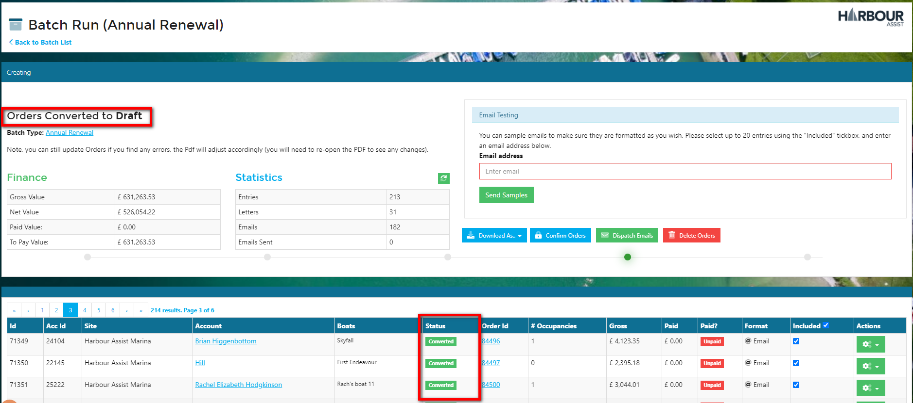
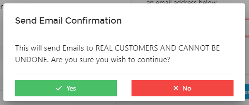

# Batch Runs #

Once your *Batch Types* are set up the next stage is to create the *Batch Renewal Run*.

## **Batch Renewal Video**

From the *Home* screen go to *Batch Tools*.

From the drop down list, select *Batch Runs*.

Click on *Create Batch*.

This will bring up a full list of all the *Batch Types* that have been created.  Select the one you wish to use.

The *Batch Run* screen shows you which *Batch Type* you have selected.

Now select the Site to include (multi-site operators have the options to select one or multiple sites) and the Pricebook to use.  

?> More documentation [here](AccountsOrdersPayments/TariffsPricebooks.md).

Now complete the rest of the information required.  Some information will be populated automatically from the *Batch Type* that you have selected, however you can edit this if necessary.

- **Order created date** - this is the date that will show on the draft order.  It will default to todays date, so unless you want to change this, just leave it blank.
- **Occupancy to create** - this will auto populate from the Batch Type, so unless you wish to amend this, just leave it as it is.  This can be left blank if you do not with to create an occupancy (membership renewals for example).
- **Start Date** - this is the start of the contract and any associated occupancy.  Use the calendar pickers to set a date.
- **Departure Date** - this is the end of the contract and any associated occupancy.  Use the calendar pickers to set a date.
- **Include Uninvoiced Meter Readings** - this will auto populate from the Batch Type.  If you wish to include meter readings this box should be ticked.
- **Renewal Groups** - this will auto populate from the Batch Type, but you can add or amend the groups to be included at this stage.

Once all the information has been populated, click on *Calculate Entries*.  

This will create a list of all customers who meet the Tariff and Renewal Group criteria that have been set.

If you are happy that the right customers have been selected, click on *Generate Orders*.  This will create *Proposed* orders for these customers.  Proposed orders do not create a balance on the customer account or show on their portal and are fully editable.

Once the *Proposed* orders are created you will see a summary of the Financial values of the orders and also details communication preferences of the customers.

You can check the Orders by clicking on the Order ID number which will take you straight into the generated order.

At this stage you can add, amend and remove any tariffs as necessary - for instance, you may have 1 customer where you have agreed a reduce rate - this is the point to make this adjustment.

You can also delete the order if it isn't required - this way you don't have to re-run the whole Batch Run - if an order is deleted the account will still show in the Batch Run, but the Status will show *Invalidated*. 

?> NB.  To be able to delete any orders the User will require the Permission of **OrderCanDelete**.

If you want to view what the paperwork you will be sending out to customer looks like you can view this by clicking on the green *Actions* button on any of the entries and selecting View Document.

At this stage there will be a *Preview* watermark on the document.

You can also send a sample of the email that will be sent to those who have opted to receive their communications by email.  Insert your email address in the *Email Testing* cell and click on *Send Samples*.

When you are happy that everything is correct, the next step is to convert the Orders.  

The screen updates to show you that you are now at the *Orders Converted* stage. The Orders have now moved from *Proposed* to *Draft* and will show as such on the customer account page and on the customers portal.  They are still fully editable at this stage though.

?> NB.  As renewal orders are normally created well in advance of the renewal date, they are sent to the customers as a Draft order, this enables the customer to come back to you with any necessary changes and you will be able to make these changes to the Draft order rather than having to raise a credit note and a new order.

Now you can start to dispatch the Orders to your customers.  Click on *Dispatch Emails*.

You will be asked to confirm you wish to continue - click OK if you are happy.

To print the Orders for those customers who wish to receive them by post, click on the *Download* button and select either Word or PDF.

If there are a large number to print and you wish to break it down into smaller groups, you can select the number of pages to output - once you have done this click *Generate*.

You will note that the Preview watermark has now been removed, so you can print in the same way you would any other document.

The Statistics now show that the emails have been sent and this also shows against the line entry.

As the Orders are paid, they will be Confirmed and given a Tax Point Date of the date of the payment.  The Finance statistics will update automatically.

On viewing the Orders tab of the customers account you can see by the icon which Orders have been created by a Batch Run.

