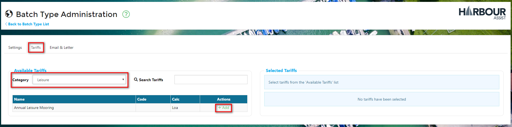

# Batch Types #

In order for a Batch Renewal Run to be created, there needs to be a *Batch Type* set up - this will form the basis of the Batch Renewal Run.

## **Batch Types Video**

To set up a *Batch Type*, from the *Home* screen select *Batch Tools*.

Then select *Batch Types*.

Click on *New Batch Type*.

### Settings

In the *Settings* tab of the *Batch Type Administration* screen, you now need to complete the details:-

- Give the Batch Type a name
- Set the Instalment Schedule, if required (only for contracts that are payable over instalments)
- Set the Order Status of the renewal.  It is advisable to set this to *Draft* (proforma), as the orders created can then be edited if any changes need to be made without having to raise a credit note
- Set the Order Type
- Set the Occupancy Type - this is optional - there may be instances where you do not want to create an occupancy (membership renewals is an example of this)
- Include un-invoiced meter readings, if required
- Set the Renewal Group to include - this is optional as it can be set when performing a Batch Renewal Run

### Tariffs

Now you need to select the Tariffs to include - as this example is for Leisure customers, we have selected the Leisure category.

This will show you a full list of the Leisure Tariffs that are set up in the system.  To include a Tariff, simply click on the +Add button.  As you select each Tariff you will see it appear in the *Included Tariffs* list.  You can remove it by clicking on the trash button.

### Email & Letter

The next stage is to upload a Renewal Letter and Order/Invoice template.  

This document can be bespoke and should be created in Word - we have a standard template that you can base this around, please contact us by raising a Help ticket if you need this sending to you.  

This will be be document that is emailed to a customer (as a PDF) or printed for those customers without email addresses.  It is normal to include a covering letter, invoice, terms & conditions of the contract and details of how to make a payment.

Click on *Choose Files* to upload your Word document.

Now you need to create a covering email - this is what the customer will receive if they have agreed to receive their communications by email.  The Renewal Letter and Order/Invoice document will be attached to this email as a PDF.

Give your email a Subject title and then complete the body of the email.

Your *Batch Type* is now ready for use.