# Instalment Batches

You can complete a Batch Run to invoice your Instalment Renewals in bulk in just the same way as you can your single payment customers.

?> NB: Before completing a Batch Run, please ensure you have correctly set up your Contracted Customers that will be paying in Instalments.

?> More Information on Contracted Customers can be found [here](ContractedCustomers/Overview.md).

## Creating an Instalment Batch Type

First, you will need to create a Batch Type.

From the Home Screen, go to *Batch Tools* and select *Batch Types*.

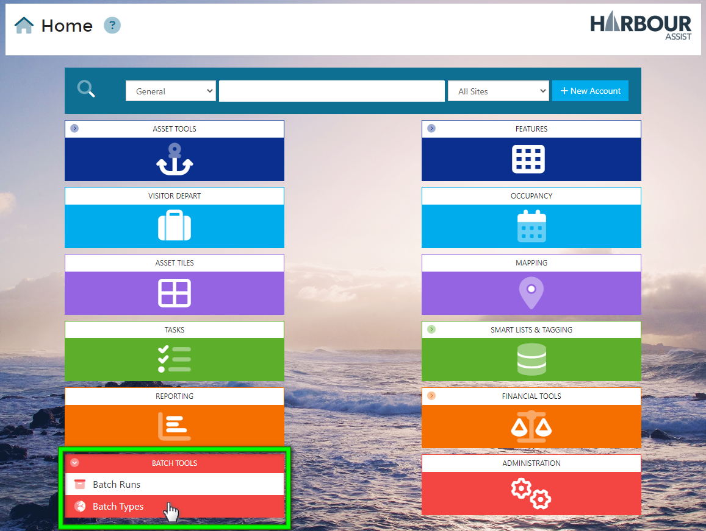

Next, click on *+ New Batch Type*

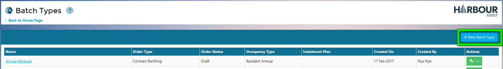

In the *Settings* tab, give your Batch Type a name.

Using the drop-down box, select the Instalment Plan you want to use. 

Then confirm the *Order Type* and *Default Occupancy Type* details.  You can also select the Renewal Group the Batch Type should default to, however this can also be populated on a Batch by Batch basis when creating the Batch Runs.

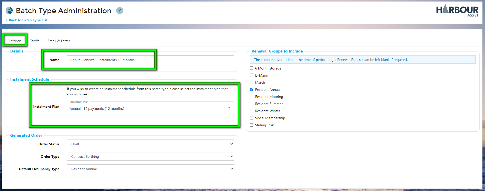

In the *Tariffs* tab, from the Tariff Categories, select the Tariffs that will be used for the Instalment Plan by clicking on the *+ Add* button.

Selected Tariffs will move from the left, to the right hand side. If you add any in error, use the *Remove* button.

?> NB: Make sure the Tariffs you select are also part of the Instalment Plan set up - click [here](Instalments/InstalmentPlans.md) for more details. 

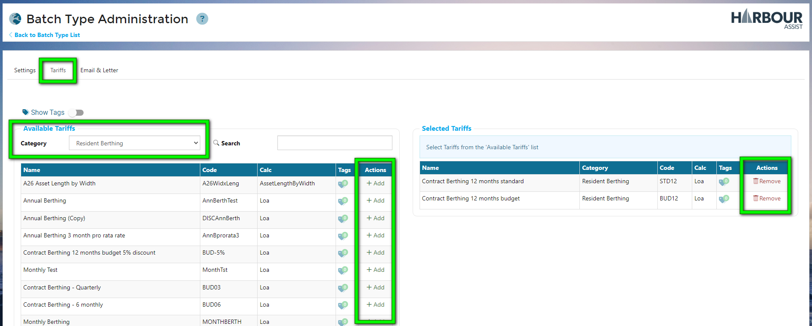

Next, using the *Email & Letter* tab, compile your email using any formatting, Snippets and Merge Fields as required.

Upload the relevant document template. Unlike single order Batch Types, you don't need to upload the invoice/order part of the template, just your covering letter as the Instalment Schedule will be merged into your document automatically.

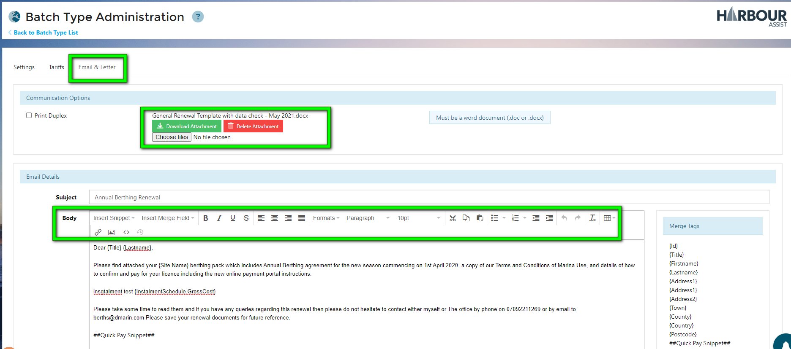

Once complete, the Instalment Batch Type will appear on the list. 

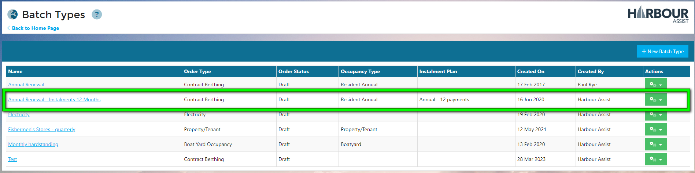

You are ready to complete your Instalment Batch Run.

## Creating an Instalment Batch Run

From the Home Screen, go to Batch Tools and select *Batch Runs*.

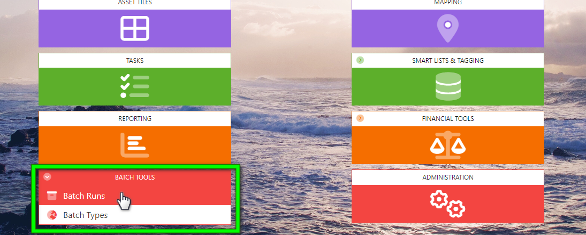

In the Batch Run page, click on the *Create Batch* button and from the drop-down list, select your Instalment Batch Type.

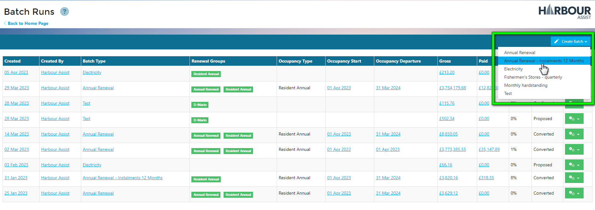

In the Entries tab, review the Occupancy details and select the Instalment Schedule Start Date.

?> NB: You cannot back-date an Instalment Schedule, so the options will begin from the month you are currently in.

Next, confirm the Site & Pricebook and add any Renewal Groups to include.

When finished, click on *Calculate Entries*

Anyone due to be included in the Batch Run will appear in the list. This is a chance to review the list to check the entries are accurate. If they don't look correct, you can click on *< Back to Batch List* and delete the Batch. Review your settings and start again.

If the list looks correct, click on *Generate Schedules*.

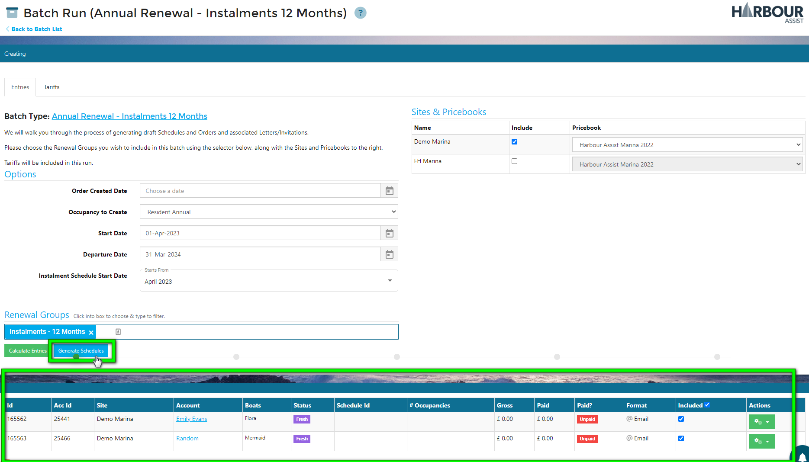

The Schedules will be generated, this is your next opportunity to review the information to ensure it is accurate.

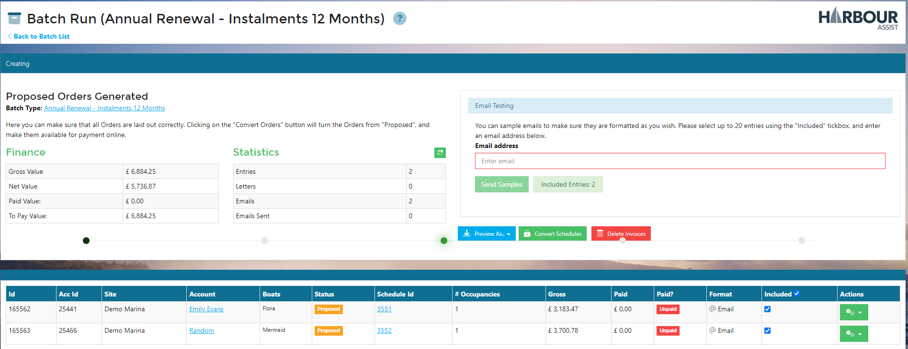

Using the action buttons and links, you can check the Schedules and Documentation generated.

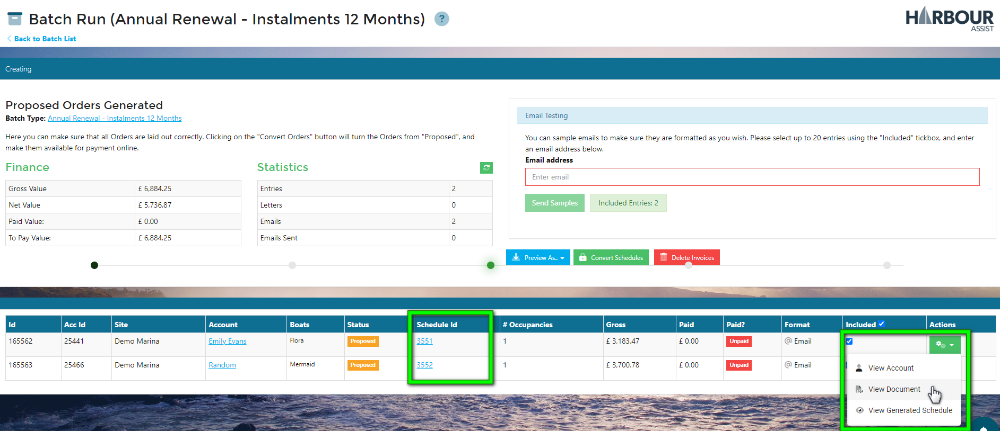

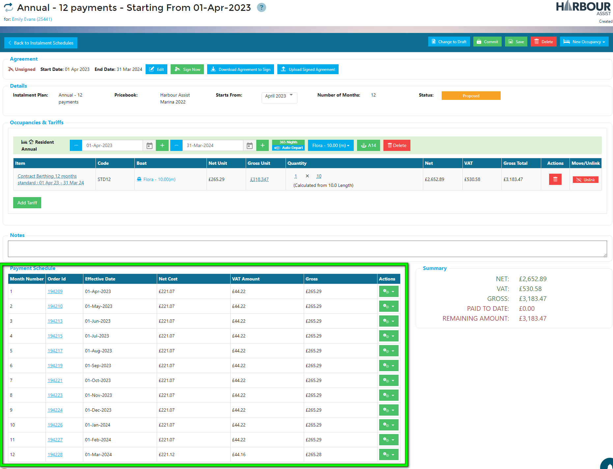

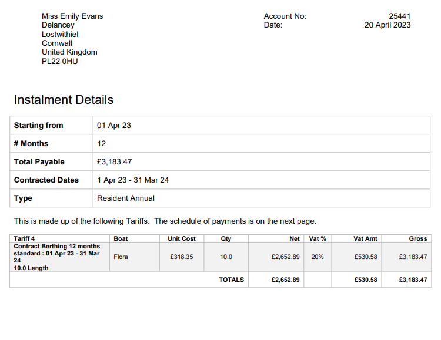

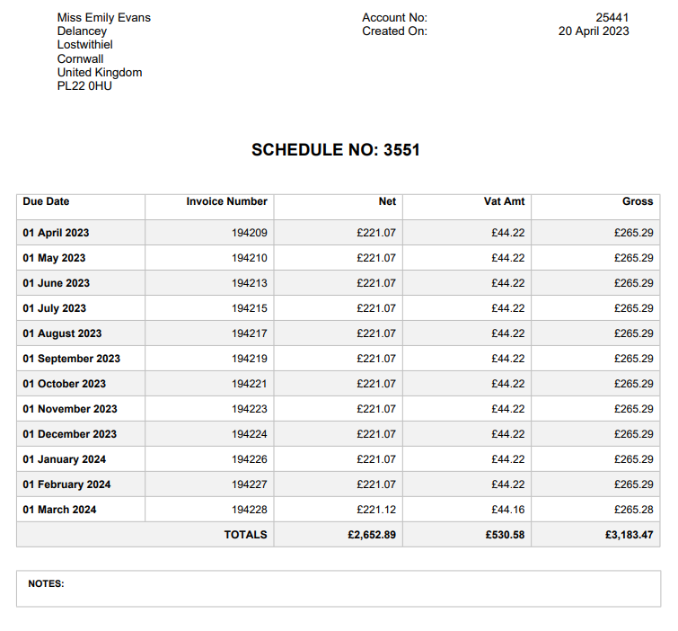

You can send yourself Sample Emails so you can review before sending them to your customers.

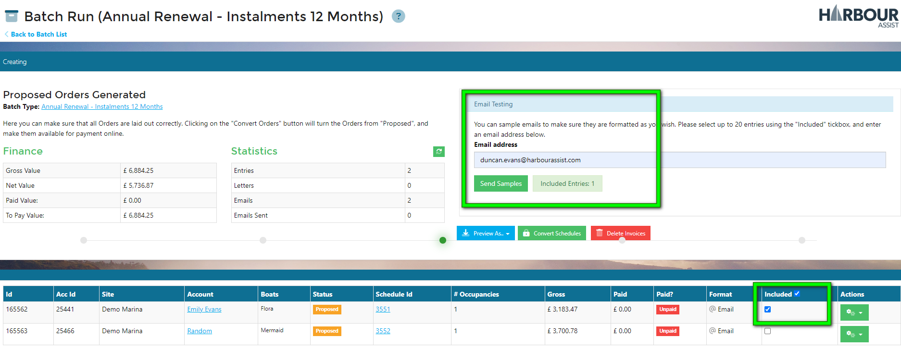

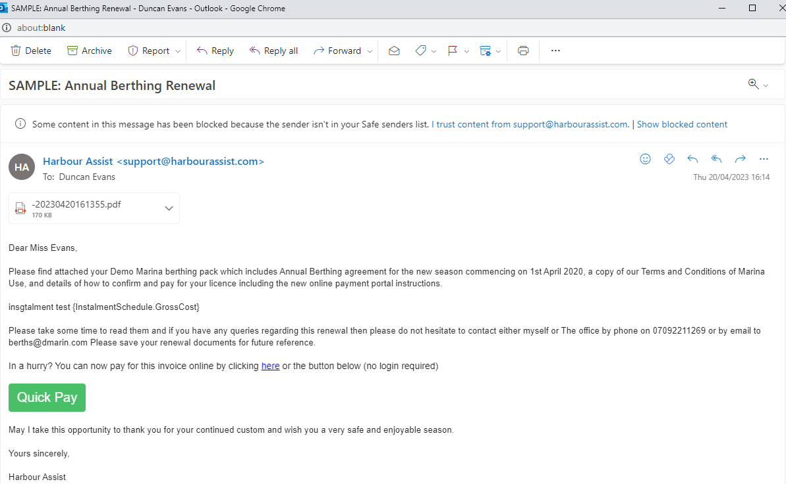

In Proposed status, customer cannot see the schedule generated, this gives you the opportunity to make any changes necessary.

When you are ready, you can convert the schedules to Draft format by clicking on the *Convert Schedules* button.  Once converted, customers will be able to see the Draft Orders in their Customer Portal, however they are still editable by users.

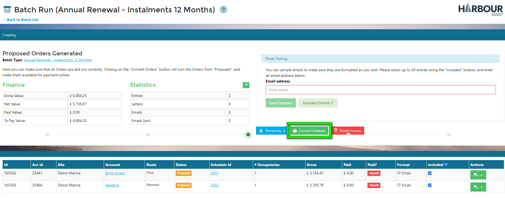

You can download any letters for customers preferring invoices by post and dispatch the emails whilst the Schedules are in this Draft format, however you may want to Confirm the Schedules before sending them out - remember, once a Schedule has been confirm, no further changes can be made to them.

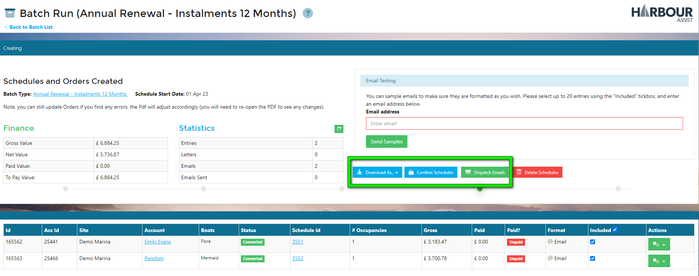