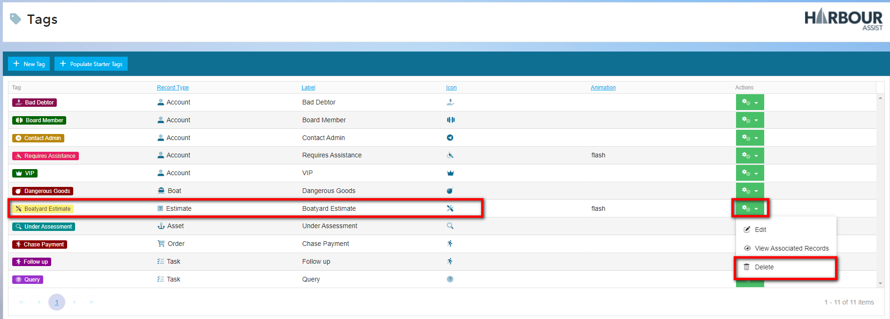

# Creating, Editing & Deleting Tags

Creating, editing and deleting tags is an easy process, the following are examples of how to carry out each action.

?> NB: The Permission of *Administration Tags* is required to be able to create or edit a Tag.

## Creating Tags Video

## Creating Tags

From the Home Screen go to ***Administration***

Then click on ***Tags***

This shows you a list of your current Tags.

Over time, the number of Tags you create will increase, so the advice would be to check current Tags to avoid duplication.

?> For information on how to ***Review Existing Tags*** click [here](Tagging/ReviewExistingTags.md)

If you are satisfied the Tag doesn't already exist, select ***+New Tag***

Populate the fields to create a New Tag:

1. **Record Type (required field)** - select the record type you want your Tag to be attached to. 

2. **Label (required field)** - Name your Tag something simple but relevant to the subject.

3. **Select an icon** - you can use the search facility to find a suitable icon by clicking on **Select Icon** & entering a key word

4. **Animation** - select an animation from the drop down list

   ?> NB: Animations might be best used for urgent information such as Health & Safety to help them stand out and catch the Users attention

5. **Guidelines** - you can add notes on how the Tag should be applied as a guide for other Users

6. **Foreground Colour** - this will determine the text colour, best used in conjunction with the *Background Colour* & *Preview* so the text can be seen clearly

7. **Background Colour** - this will determine the main colour of the Tag, use in conjunction with the *Foreground Colour* & *Preview* (as above)

8. **Preview** - this will automatically populate how your Tag will look, so you can make necessary changes before saving

Once you have completed the fields, click *Save*

Your new Tag will appear in the list and is ready to go

## Editing Tags Video

## Editing Tags

You may decide you want to edit an existing Tag for various reasons, such as change the Guidelines, Label or perhaps you simply don't like the colour.

?> NB: You are not able to change the Record Type of an existing Tag.  You will need to either create a New Tag or Delete the Tag if it is not needed.

Editing Tags is similar to Creating a New Tag.  From the Home Screen go to ***Administration***

Then click on ***Tags***

This shows you a list of your current Tags.

To Edit a Tag, click on the green ***Actions*** button, and from the drop down list, select ***Edit***

In the *Edit Tag* box, make the necessary changes, then click ***Save***

Your changes will now show on the Tag in the list.

## Deleting Tags Video

## Deleting Tags

Housekeeping Tags will be necessary if they begin to build up, you may wish to delete unused tags to reduce the clutter.

?> NB: **Once a Tag is deleted, it is not possible to reinstate it**.

From the Home Screen go to ***Administration***

Then click on ***Tags***

Check the list of current Tags to find the Tag you want to delete

To Delete a Tag, click on the green ***Actions*** button, and from the drop down list, select ***Delete***.

If you are sure you want to delete the Tag, click *Yes*.

If your Tag is associated with any existing records it will alert you, giving you the option to go back and check before deleting it.

