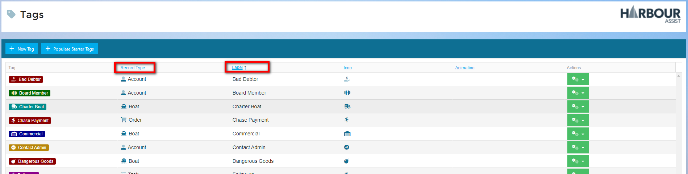
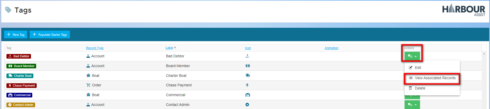
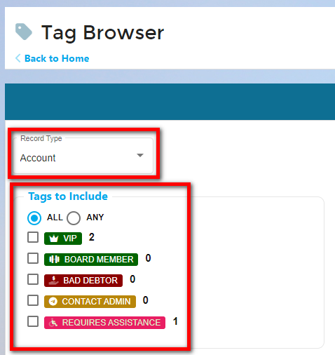

# Review Existing Tags

## Review Exisiting Tags Video

Over time, the number of Tags you create will increase, so the advice would be to check current Tags to avoid duplication, you could do this in a couple of different ways.

Clicking on the headings ***Record Type*** or ***Label*** will sort your Tags into alphabetical order - making it easier to visually check the same or similar Tag doesn't already exist.

Alternatively you can click on the green ***Actions*** button and select ***View Associated Records***.

This takes you to the Tag Browser. To review the existing Tags, filter down by selecting the Record Type your Tag will be linked to (eg. Account, Boat, Document etc). You can review the list to see if your Tag already exists thus avoiding duplication.

