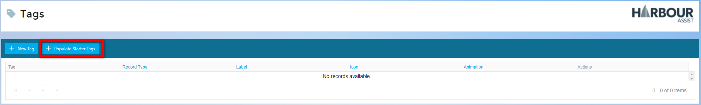

# Starter Tags

## Tags Overview and Starter Tags Video

Harbour Assist have provided some basic *Starter Tags* to get you going.  To populate these, from the **Home Screen**, go to **Administration**.

Then select **Tags.**

Entering this screen for the first time, the Tag List will be empty. Now click on ***+Populate Starter Tags***.

Use this box to review your selection, any Tags you don't want, or won't need, you can untick the box next to the Tag.  When you have finished reviewing them, click ***Save*** - Don't forget you can Create, Edit or Delete Tags later.

Your list of Starter Tags will now show and are ready to use.

?> For more information on Using Tags click [here](Tagging/UsingTags.md)

