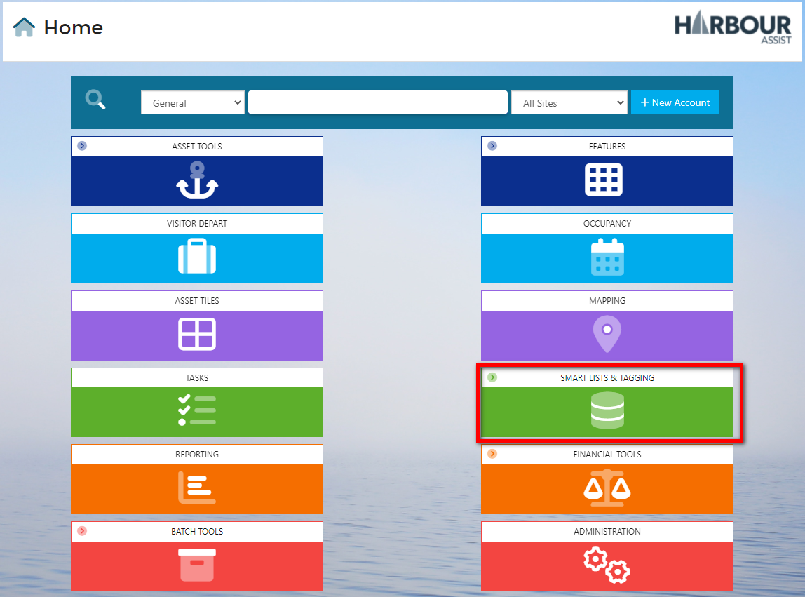
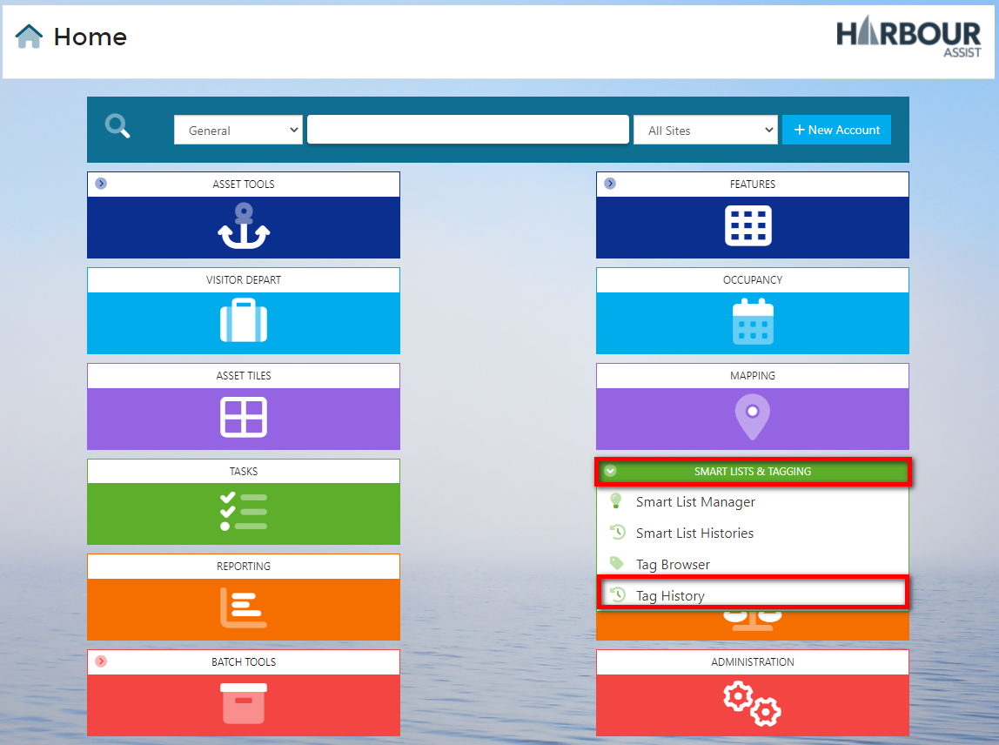
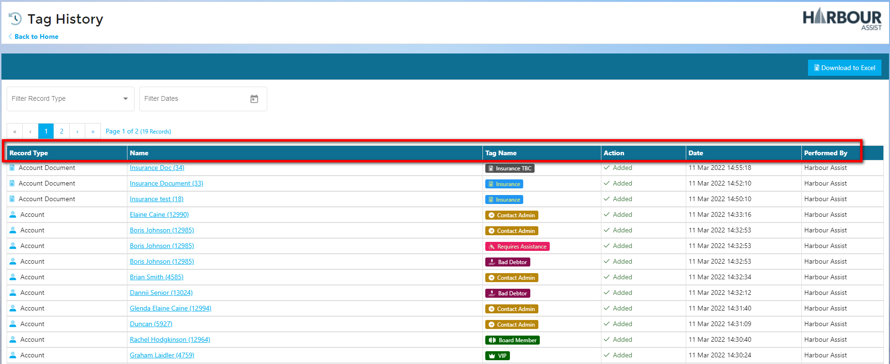
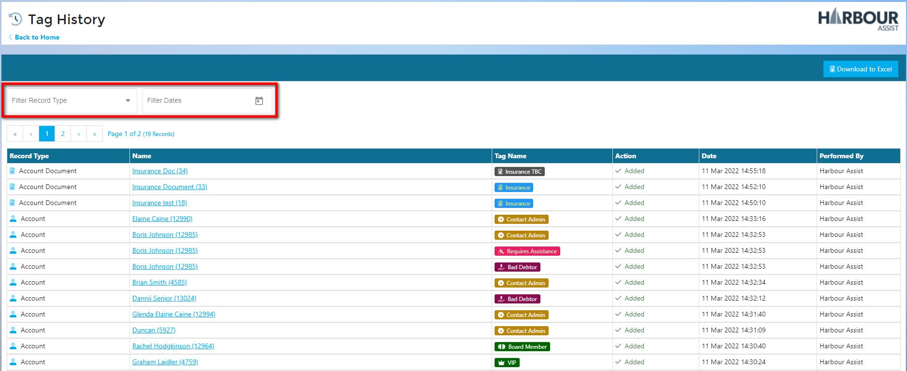
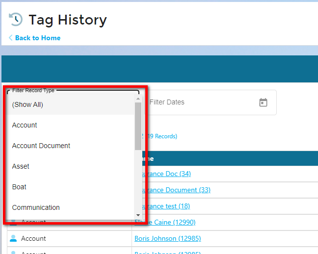
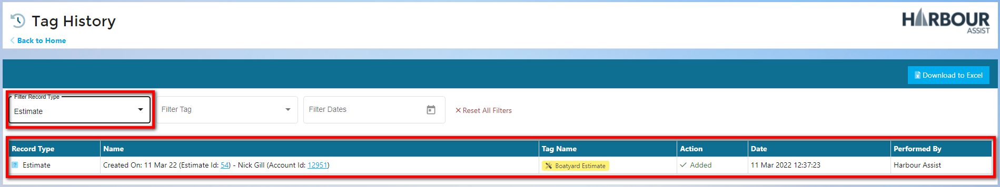
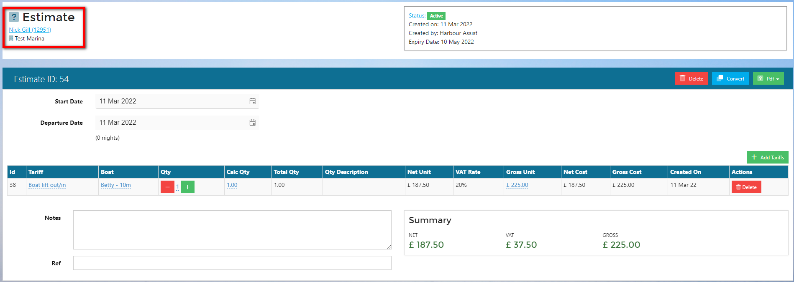
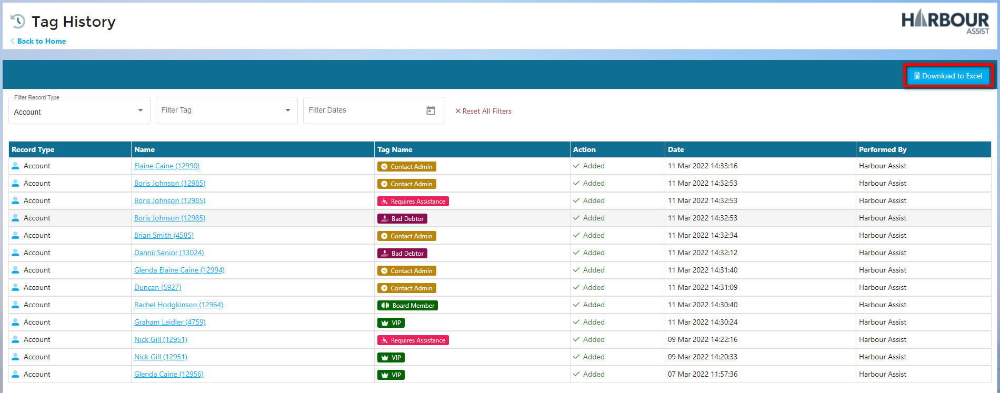

# Tag History

## Tag History Video

Tag History shows a detailed history of the Tags created, deleted, what the Tag was called, what it was related to, the Record Type and who performed the action. The list is shown in date order.

From the Home Screen, go to ***Smart Lists & Tagging.***

From the drop down list go to ***Tag History***.

This screen lists the full Tag History including *Type/Name/Tag Name/Action/Date/Performed By*.

The list is is date order starting with the most recent actions first.

You can Filter By Record Type and also set a date range.

Using the filters, you can drill down to specific Tags to save searching through a long list.

In this example, I have filtered by Record Type 'Estimate'.

I can see from this result, this Tag was created on 11th March 2022 for a Boatyard Estimate by Harbour Assist. From this list I can also go directly to the Estimate or to the Account this Tag has been linked to.

By using this link, I can manage this estimate by converting it, deleting it if expired, or contacting the Account Holder for an update.

You can also download your filtered list to Excel to create your own report.

