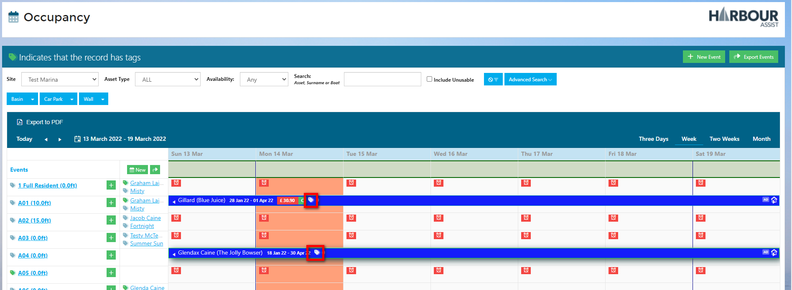

# Using Tags

## Using Tags - Video

Once Tags have been created, the process of using them is easy - remembering to use them is key to getting the full benefit of Tags.

The example here is how to use a Tag on an Account, all Tags work the same way.

## Adding and Removing Tags to an Account

Firstly find the relevant Account.

To add a Tag, click on the little *Pen Icon* next to ***No Tag*** (if the Account already has Tags attached, they will show here).

A pop up box will appear with all the available Tags associated with an Account

Select the Tags you want to add to this account, you can also add any notes to the Tag so other Users can read them. You can add as many Tags from the list as you need. Then click *Save*

Any Tags you have added will now appear under the Account Name in the colour and with the animation that has been set for that Tag type.  

To remove a Tag from an Account, click on the *Pen Icon* and toggle the button to switch it off, then click *Save*.

The Tag will no longer appear on the Account

Tags work in exactly the same way for each Record Type, here are examples of where to find Tags on their associated Record Types.

## Adding Tags to a Boat

## Adding Tags to Account Documents

## Adding Tags to an Asset

## Adding Tags to Communications

## Adding Tags to an Estimate

## Adding Tags to a Meter Reading

## Adding Tags to an Occupancy

To add a Tag to an Occupancy you can either click on the Tag icon on the occupancy line to add a Tag from the pop-up box,

Alternatively click anywhere on the occupancy line & selecting **View/Edit**

Add your **Occupancy Tag** here, you can also add Tags to the **Asset**, **Account** and **Boat** from here. If there is an order on the Account, this will also show.

## Adding Tags to an Order

## Adding Tags to a Payment

## Adding Tags to a Tariff

## Adding Tags to a Task 

## Adding Tags to a Waiting List

