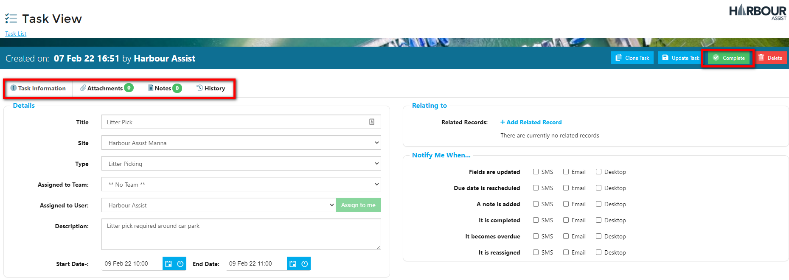
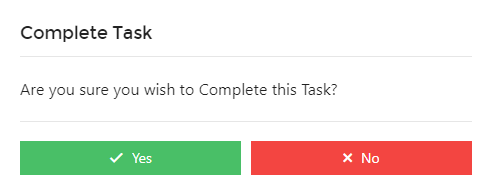
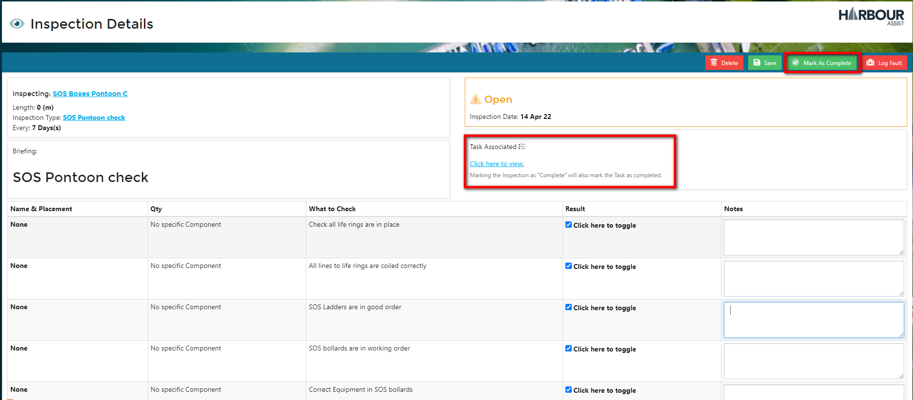

# Completing Tasks

Whatever the Task is, or associated to, they all work in the same way which provides a consistency throughout Harbour Assist.

From the Task View, check the Tabs for any additional information, such as notes or attachments. 

Complete the physical task, and then confirm the task has been completed by clicking the *Complete* box.

Then click *Yes* to confirm and close the Task.

Tasks can't always be completed on the first attempt, so keeping the Task up to date with the relevant notes is important.

?> For more documentation about Editing & Updating Tasks click [here](Tasks/EditingUpdatingTasks.md).

## Associated Tasks with Inspections

Some Task are related to Inspections, marking the Inspection as 'Complete' will also mark the Task as completed, so there is no separate action required.

?> NB. The system will not let you complete a Task that is associated to an Inspection independently of completing the Inspection.

