# Creating a Task

A Task can be created from numerous places within the system and associated with one or more records ie. an account, a boat, an asset or an order, or no records at all.

## Creating a Task from an Account

Once you are in the relevant Account, click on the *Tasks* tab.

?> NB. The tab header will also show you the number of open Tasks on the Account.

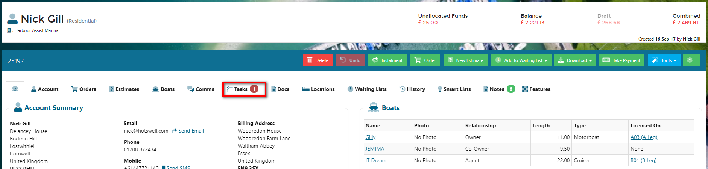

Then click on *New Task*.

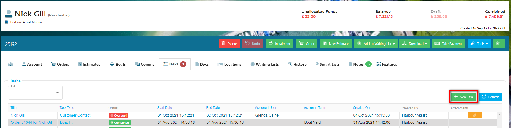

Complete the following information:-

1. **Title** - this will be set automatically if a Task is associated to a Boat, Account, Asset or Order, however you can override or amend this title.
2. **Site** - when creating a Task from an Account this will be automatically populated with the Account site.  This cannot be overridden.
3. **Type** - this should be chosen from the drop down choices.
4. **Assigned to Team** - choose the Team from the drop down choices.  Leave blank if the Task is for a User.
5. **Assigned to User** - choose the User from the drop down choices or use the *Assign to me* button if the Task is a reminder for yourself.  Leave blank if the Task is for a Team.
6. **Description** - enter further details of what the User or Team need to do, if required.
7. **Start Date** - this will default to either the current date and time (unless the Start Date Delay has been set in the Task Type set up administration).  If you wish to delay the start of a Task, set the date and time using the date and time pickers.
8. **End Date** - use the date and time pickers to set the end date and time of the Task.
9. **Related Records** - when creating a Task from a record (Account, Asset or Order) they will automatically show as a related record.  Use the *+ Add Related Record* button to add any more records to the Task.
10. **Notify Me When** - if you wish to receive notifications for this particular task, check the notification method against any of the stages of the Task.

Once the detail is populated click on the *Save New Task* button.

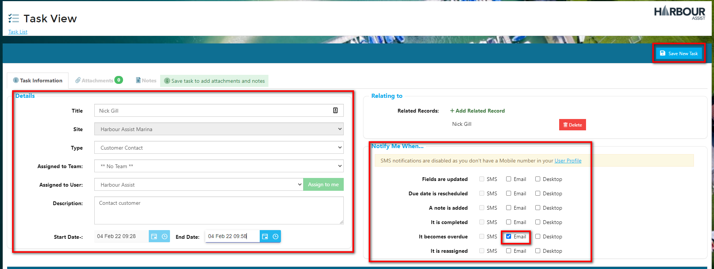

If a Task has been assigned to a User, the system will automatically send an email notification to the User informing them that they have been set a new Task.

The Task will also appear in the Task Notifications panel in the main system toolbar for the User or Team it has been assigned to.

?> NB. Tasks that are assigned to a Team will not send an email notification.

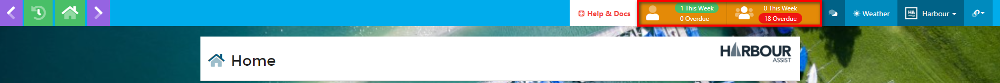 

## Creating a Task from an Order

The Tasks detail shows within an Order at the bottom of the Order page.

To create a new Task click on the *New Task* button.

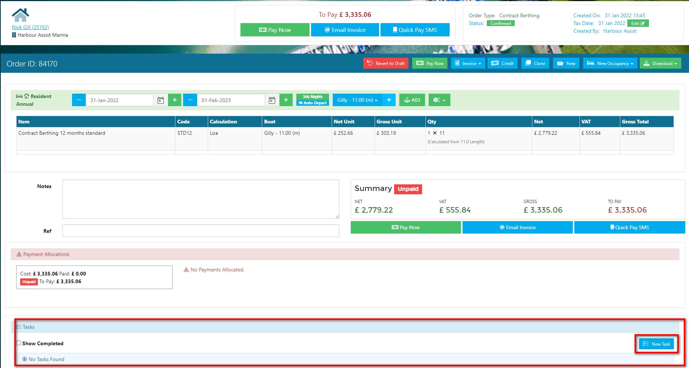

Complete the following information:-

1. **Title** - this will be set automatically if a Task is associated to a Boat, Account, Asset or Order, however you can override or amend this title.
2. **Site** - when creating a Task from an Order this will be automatically populated with the site the Order is associated with.  This cannot be overridden.
3. **Type** - this should be chosen from the drop down choices.
4. **Assigned to Team** - choose the Team from the drop down choices.  Leave blank if the Task is for a User.
5. **Assigned to User** - choose the User from the drop down choices or use the *Assign to me* button if the Task is a reminder for yourself.  Leave blank if the Task is for a Team.
6. **Description** - enter further details of what the User or Team need to do, if required.
7. **Start Date** - this will default to the current date and time (unless the Start Date Delay has been set in the Task Type set up administration).  If you wish to delay the start of a Task, set the date and time using the date and time pickers.
8. **End Date** - use the date and time pickers to set the end date and time of the Task.
9. **Related Records** - when creating a Task from a record (Account, Asset or Order) they will automatically show as a related record.  Use the *+ Add Related Record* button to add any more records to the Task.
10. **Notify Me When** - if you wish to receive notifications for this particular task, check the notification method against any of the stages of the Task.

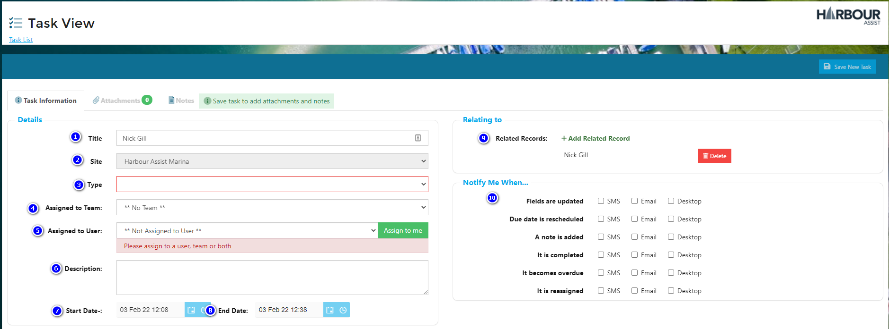

Once the detail is populated click on the *Save New Task* button.

Once saved, you will be able to access the Task from the Tasks tab on the Account,

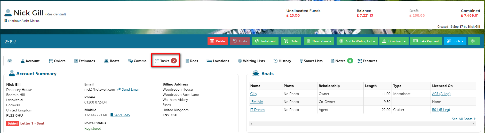

or from within the Order.

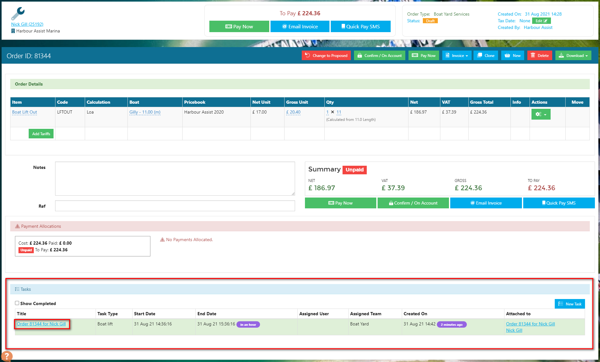

If a Task has been assigned to a User, the system will automatically send an email notification to the User informing them that they have been set a new Task.

The Task will also appear in the Task Notifications panel in the main system toolbar for the User or Team it has been assigned to.

?> NB. Tasks that are assigned to a Team will not send an email notification.

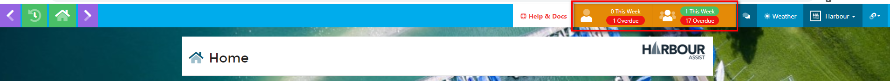 

## Creating a Task from an Asset

Open up your Asset from the Asset List by hovering over Asset Tools, then selecting Asset List. You can use the filter tools to search for a specific asset.

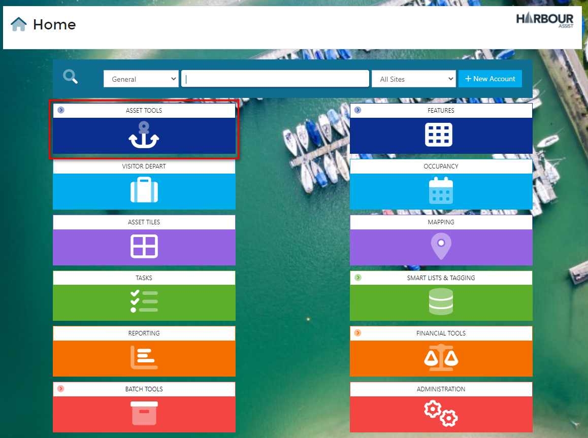

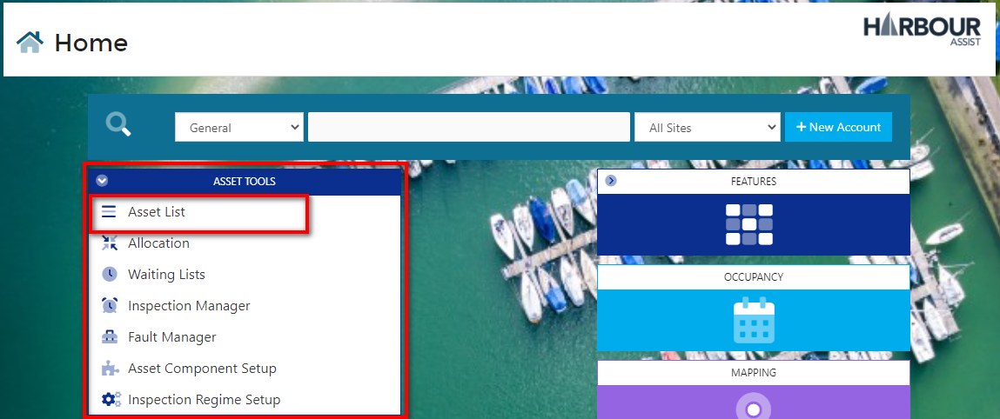

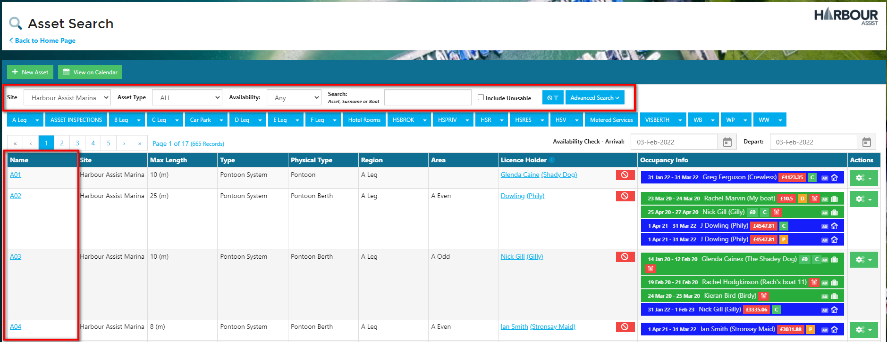

Click on the Tasks tab.

?> NB. The tab header will also show you the number of open Tasks on the Account.

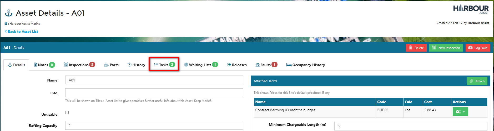

Then click on *New Task*.

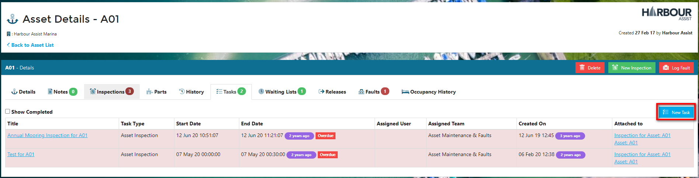

Complete the following information:-

1. **Title** - this will be set automatically if a Task is associated to a Boat, Account, Asset or Order, however you can override or amend this title.
2. **Site** - when creating a Task from an Asset this will be automatically populated with the Asset site.  This cannot be overridden.
3. **Type** - this should be chosen from the drop down choices.
4. **Assigned to Team** - choose the Team from the drop down choices.  Leave blank if the Task is for a User.
5. **Assigned to User** - choose the User from the drop down choices or use the *Assign to me* button if the Task is a reminder for yourself.  Leave blank if the Task is for a Team.
6. **Description** - enter further details of what the User or Team need to do, if required.
7. **Start Date** - this will default to the current date and time (unless the Start Date Delay has been set in the Task Type set up administration).  If you wish to delay the start of a Task, set the date and time using the date and time pickers.
8. **End Date** - use the date and time pickers to set the end date and time of the Task.
9. **Related Records** - when creating a Task from a record (Account, Asset or Order) they will automatically show as a related record.  Use the *+ Add Related Record* button to add any more records to the Task.
10. **Notify Me When** - if you wish to receive notifications for this particular task, check the notification method against any of the stages of the Task.

Once the detail is populated click on the *Save New Task* button.

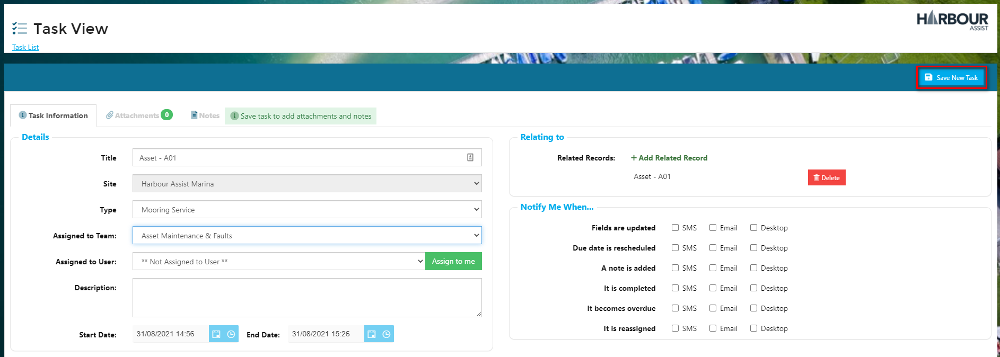

Once saved the Task will appear on the tasks Tab of the Asset.

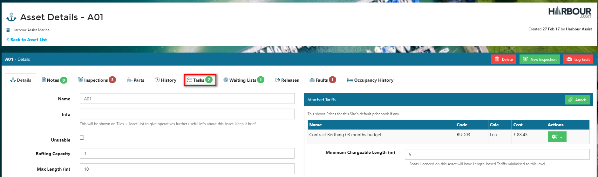

If a Task has been assigned to a User, the system will automatically send an email notification to the User informing them that they have been set a new Task.

The Task will also appear in the Task Notifications panel in the main system toolbar for the User or Team it has been assigned to.

?> NB. Tasks that are assigned to a Team will not send an email notification.

  

## Creating a Task from a Boat

You can also create a task from a boat. From the boat screen, select *Create Task*

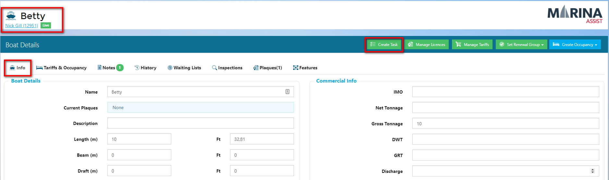

Complete the following information:-

1. **Title** - this will be set automatically if a Task is associated to a Boat, Account, Asset or Order, however you can override or amend this title.
2. **Site** - when creating a Task from an Asset this will be automatically populated with the Asset site.  This cannot be overridden.
3. **Type** - this should be chosen from the drop down choices.
4. **Assigned to Team** - choose the Team from the drop down choices.  Leave blank if the Task is for a User.
5. **Assigned to User** - choose the User from the drop down choices or use the *Assign to me* button if the Task is a reminder for yourself.  Leave blank if the Task is for a Team.
6. **Description** - enter further details of what the User or Team need to do, if required.
7. **Start Date** - this will default to the current date and time (unless the Start Date Delay has been set in the Task Type set up administration).  If you wish to delay the start of a Task, set the date and time using the date and time pickers.
8. **End Date** - use the date and time pickers to set the end date and time of the Task.
9. **Related Records** - when creating a Task from a record (Account, Asset or Order) they will automatically show as a related record.  Use the *+ Add Related Record* button to add any more records to the Task.
10. **Notify Me When** - if you wish to receive notifications for this particular task, check the notification method against any of the stages of the Task.

Once the detail is complete, click on *Save New Task* 

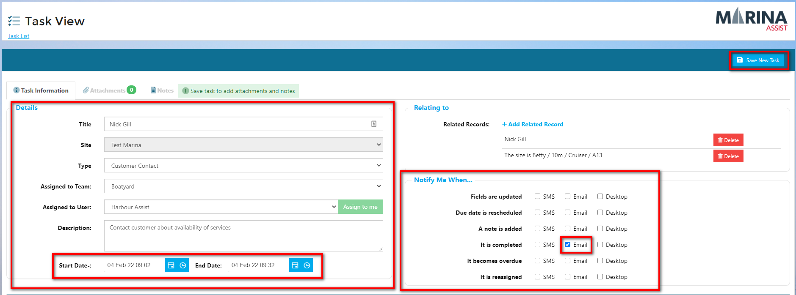

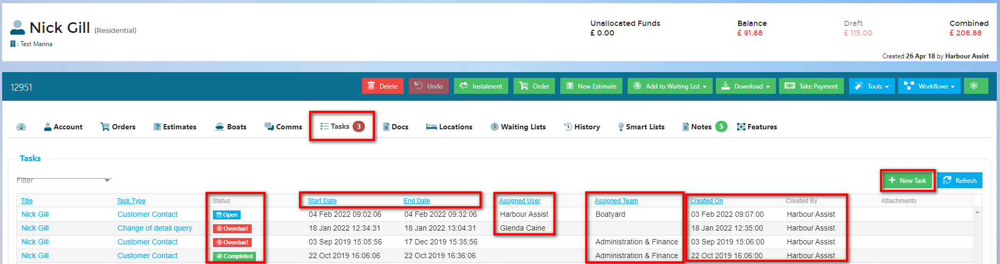

Once saved the Task will appear on the tasks Tab of the Account

## Standalone Tasks

You can also create Tasks that are not associated with a record in the system.  These standalone Tasks are created from within the Tasks tile.

From the Home page, click on *Tasks*.

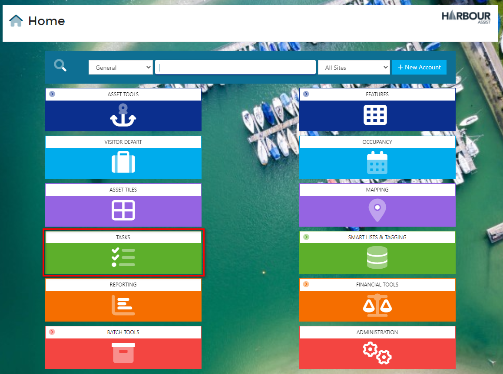

Then *Create Task*.

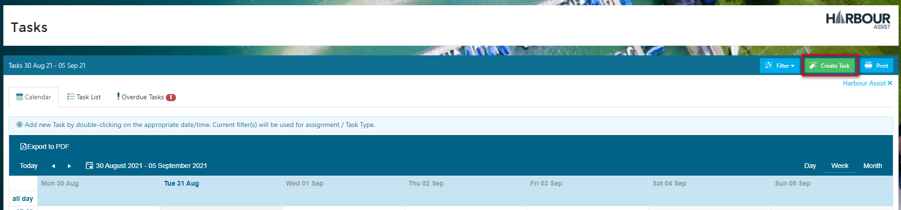

If you are a multi-site operator you will be asked which site the task relates to; choose from the dropdown list,

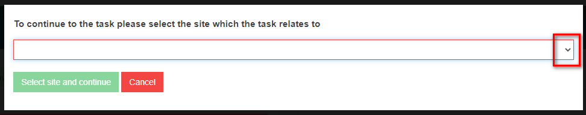

and then hit *Select site and continue*.  

?> NB. These steps won't show for single site operators.

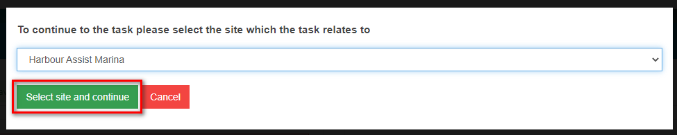

Complete the following information:-

1. **Title** - this is a free text box.
2. **Site** - for single site operators this will be populated automatically with the Site name.  For multi-site operators this will display the site selected in the previous step. This can be changed if you want to create the task for a different Site.
3. **Type** - this should be chosen from the drop down choices.
4. **Assigned to Team** - choose the Team from the drop down choices.  Leave blank if the Task is for a User.
5. **Assigned to User** - choose the User from the drop down choices or use the *Assign to me* button if the Task is a reminder for yourself.  Leave blank if the Task is for a Team.
6. **Description** - enter further details of what the User or Team need to do, if required.
7. **Start Date** - this will default to the current date and time (unless the Start Date Delay has been set in the Task Type set up administration).  If you wish to delay the start of a Task, set the date and time using the date and time pickers.
8. **End Date** - use the date and time pickers to set the end date and time of the Task.
9. **Related Records** - when creating a standalone Task no Related Records will show.  If you do want to add any Related Records use the *+ Add Related Record* button to add these.
10. **Notify Me When** - if you wish to receive notifications for this particular task, check the notification method against any of the stages of the Task.

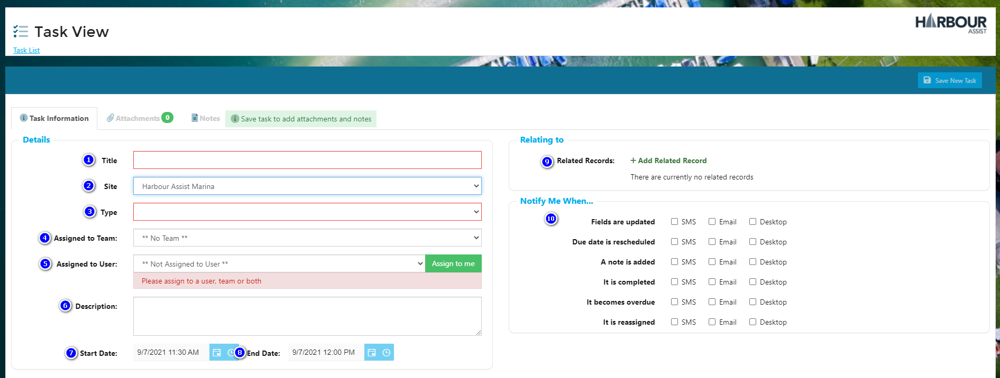

Once the detail is populated click on the *Save New Task* button.

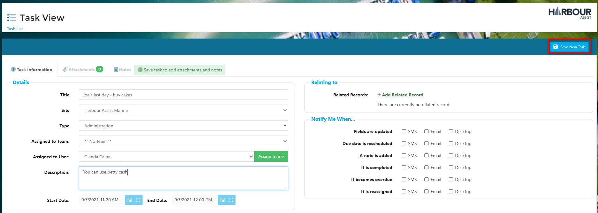

If a Task has been assigned to a User, the system will automatically send an email notification to the User informing them that they have been set a new Task.

The Task will also appear in the Task Notifications panel in the main system toolbar for the User or Team it has been assigned to.

?> NB. Tasks that are assigned to a Team will not send an email notification.

