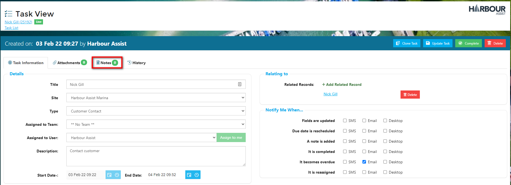
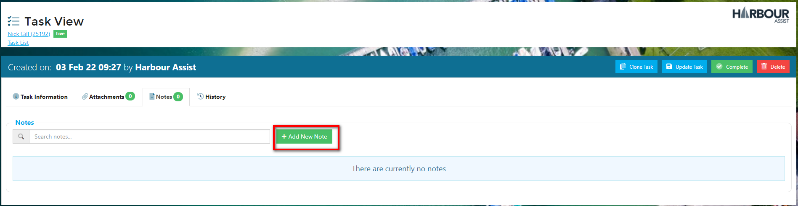
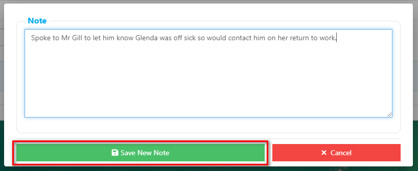
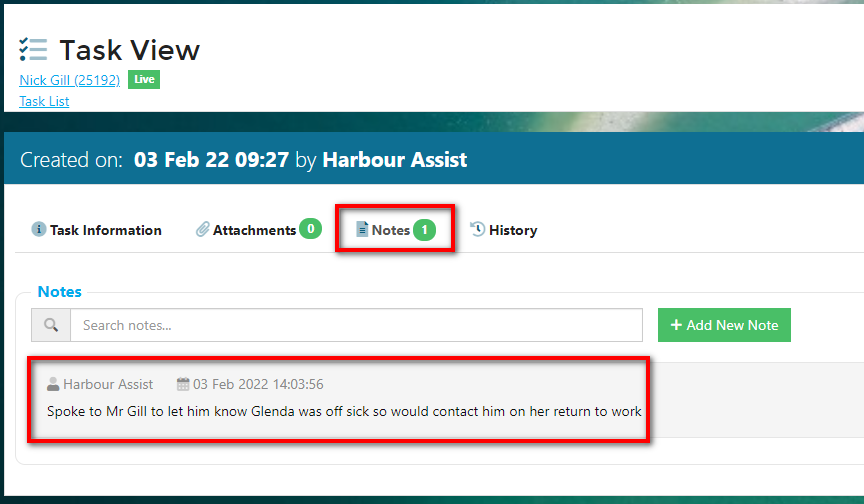
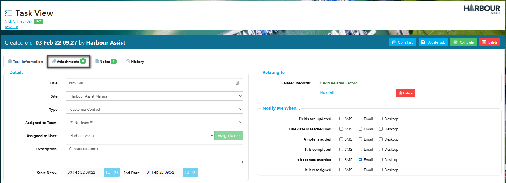
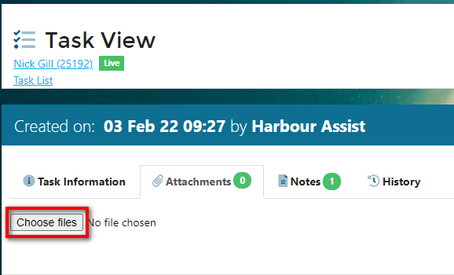
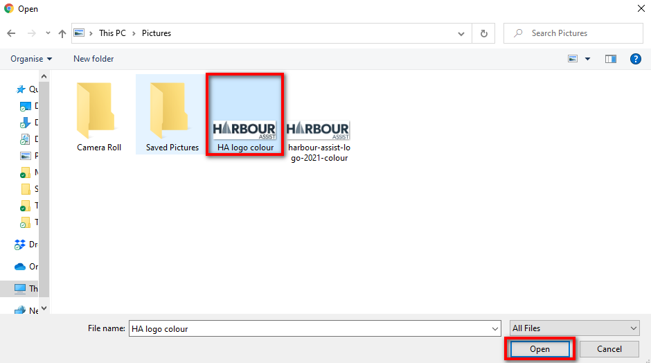
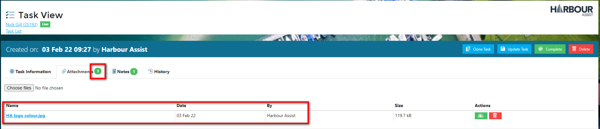
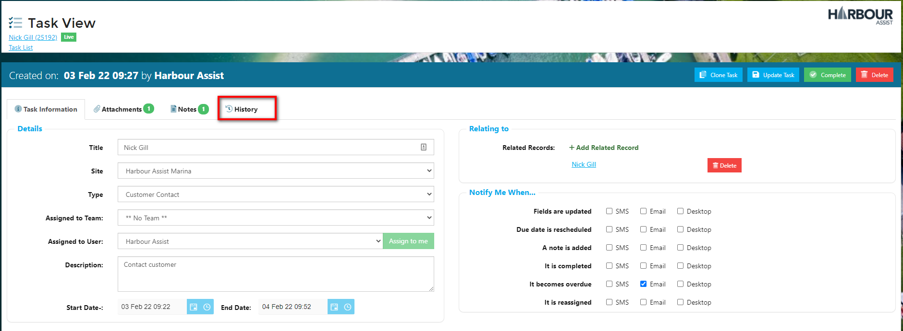
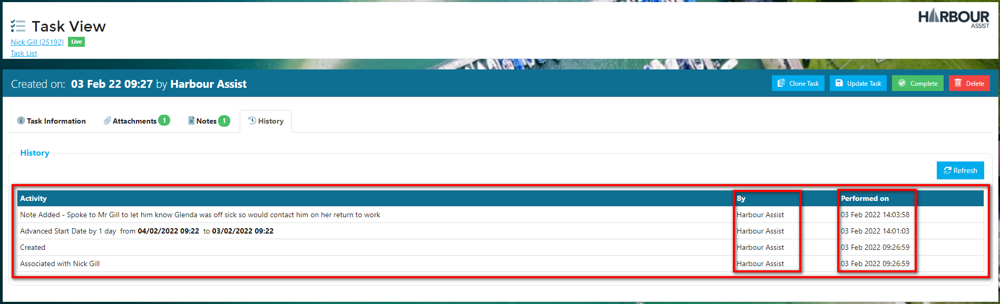

# Editing and Updating Tasks

Once a Task is created, it's important to keep it up to date so that other users who view the Task can see the whole picture.  This can be done by adding Notes to the Task, reassigning the Task to a different user or team, and re-scheduling the Task as necessary.

?> NB: The Permission of TaskEdit is required to be able to edit a Task.

## Adding a Note to a Task

It is useful to add Notes to a Task; this could be to inform other users you are dealing with the task or inform the user the Task has been assigned to that there has been an update i.e. the customer called again etc.

Any User with the Permission of TaskEdit can add a note to any Task.

Within the Task, click on the *Notes* tab.

Click on *Add New Note*.

Add the detail to the text box, then click on *Save New Note*.

?> NB: There is no need to enter the date, time or who is adding the note in the text box as this will be added automatically when you save the note.

The Note has been added to the Task with a date and time stamp and the Notes tab shows that there is 1 note on the Task.

## Adding an Attachment to a Task

Any document can be added to a Task to give users more information.

Within the Task click on the *Attachments* tab.

Click on *Choose File*s.

Select the file from your file manager and click *Open*.

The file has been added as an attachment and the Attachments tab shows there is 1 attachment on the Task.

## Check Task History

You can check the Task History, so you can keep up to date with progress. Click on *History*.

 

From the History tab, you can see any updates or changes made, who made them and the date they were made.

