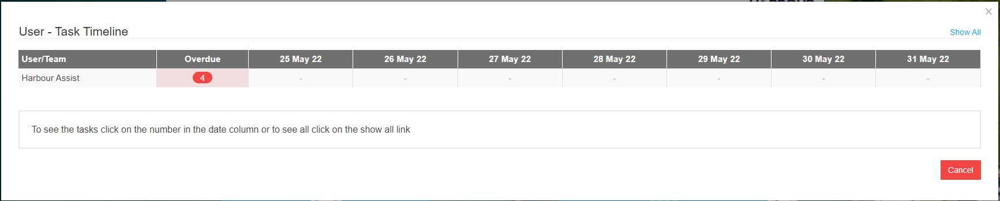
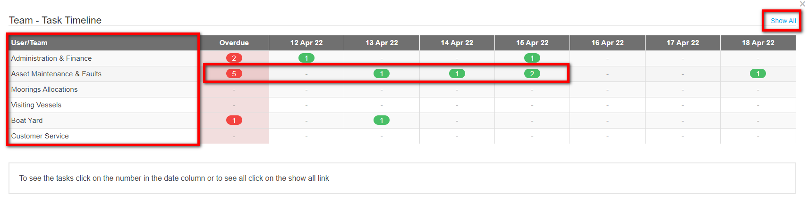
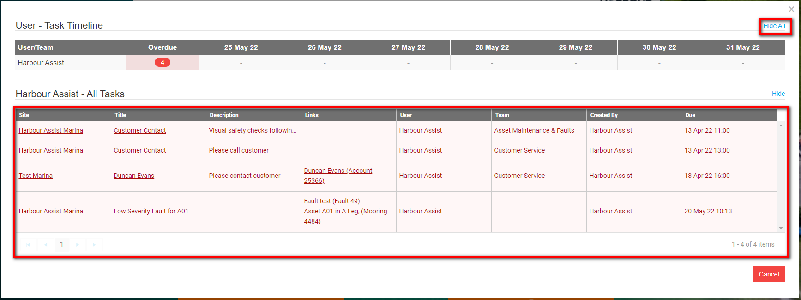
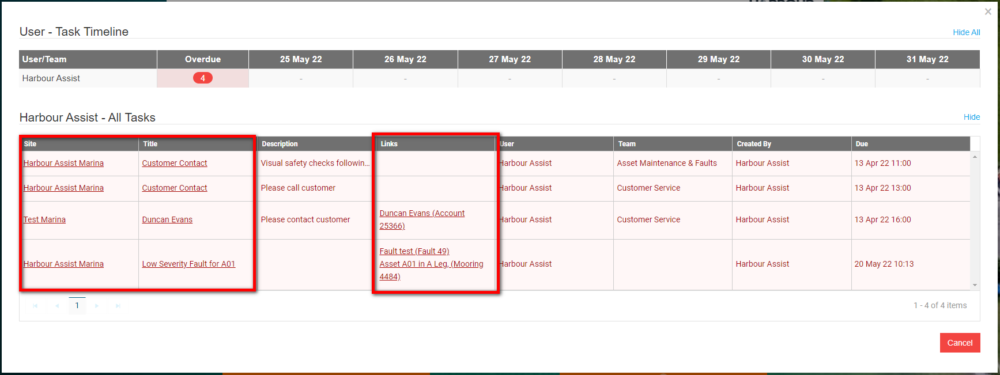

# Monitoring Your Tasks

Monitoring tasks is a key way to plan ahead and organise your time.

## Top Toolbar

You can see a snapshot of your own Tasks and Tasks for the Team(s) your are in from the top toolbar on the Home Screen. 

Clicking on either of these will open up a Task Timeline table, the Timeline will show any overdue Tasks, and Tasks due within the next 7 days.

**User - Task Timeline**

**Team - Task Timeline**

By clicking on Show All, the Timeline will reveal more detail surrounding the Tasks.

You can click on the Links within the table to view and complete a Task.

