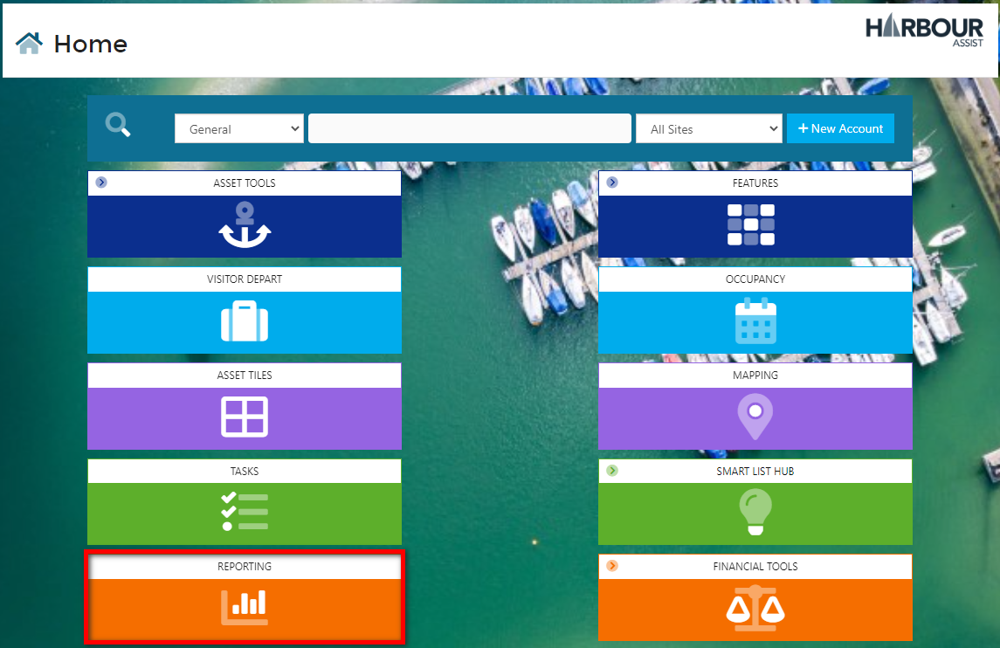
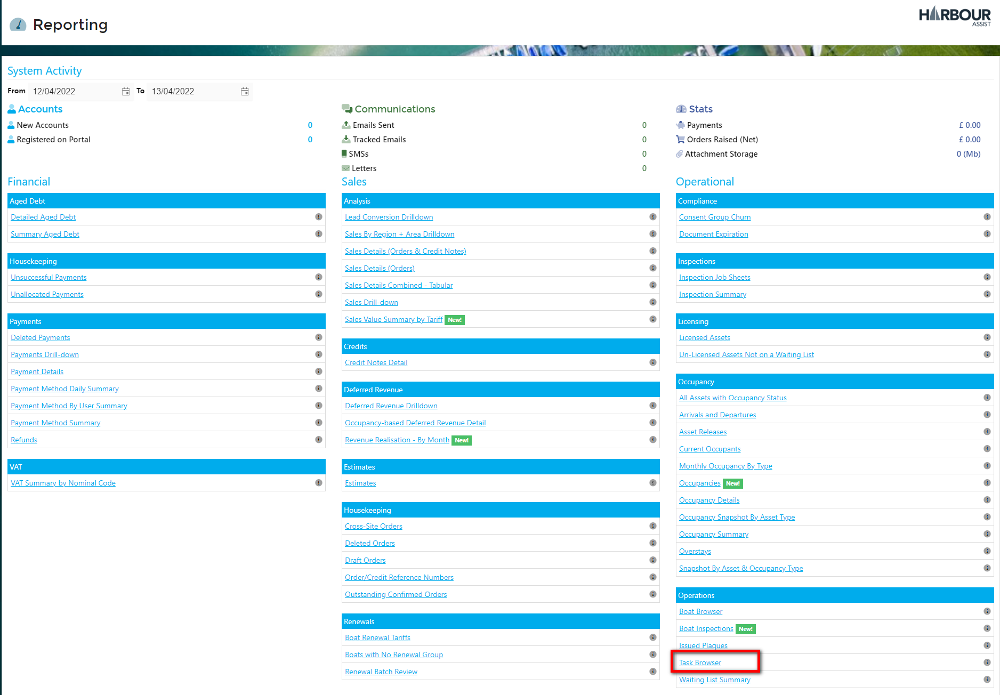
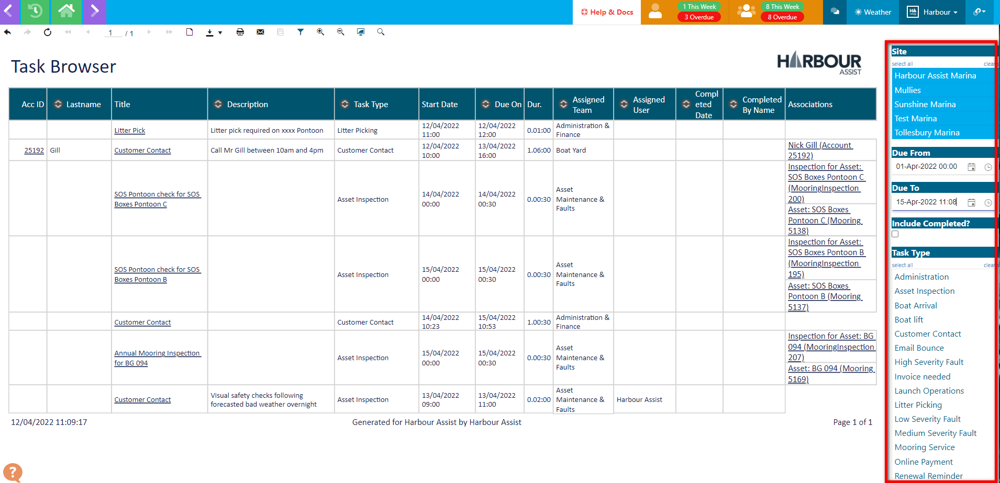
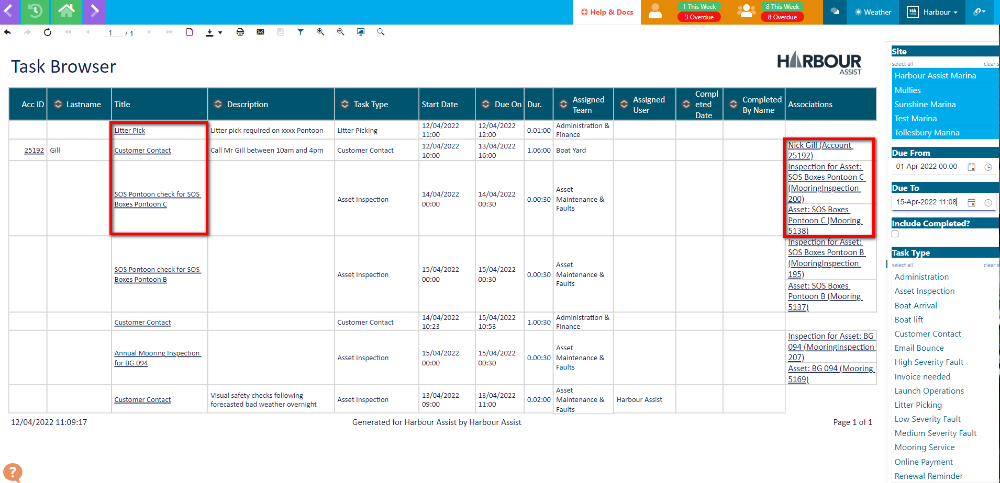
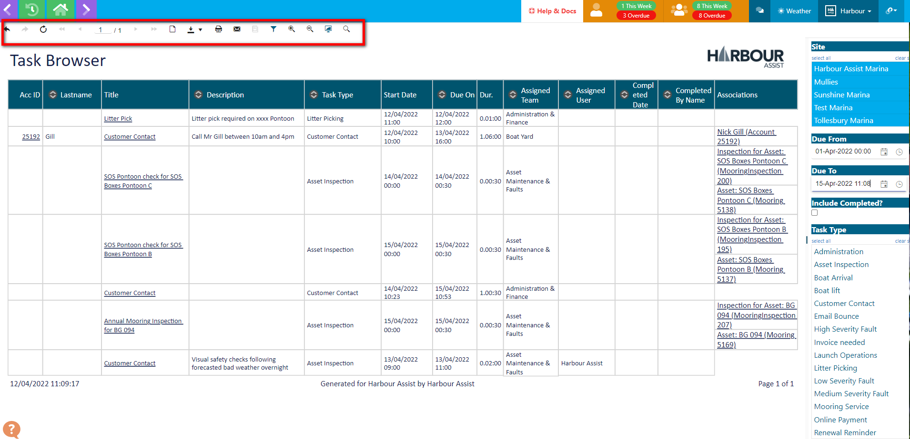

# Task Browser

To get a report on Tasks, from the Home Screen, go to *Reporting*.

From the list of reports, select *Task Browser*.

Using the filters on the right you can select one or all of your sites (Multi-Site operators), change the date range, include completed Tasks and select one or more Task Types.

Links are built into the Report, enabling you to either go directly to the Task by clicking on the Title, or you can view what the Task is linked to, such as an account, by clicking on the Associations.

Along the top of the report, there are additional options such as Print, Email and download to Excel.

