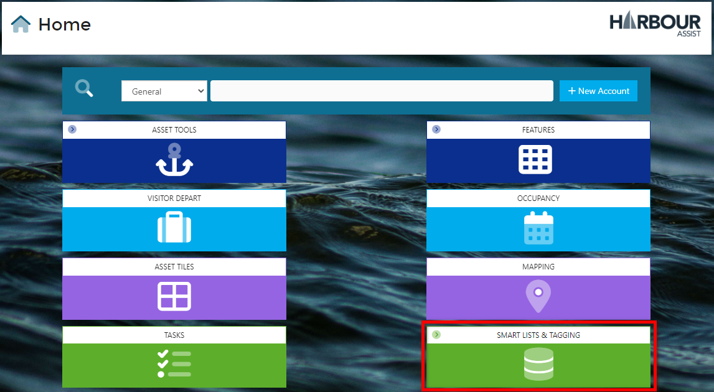
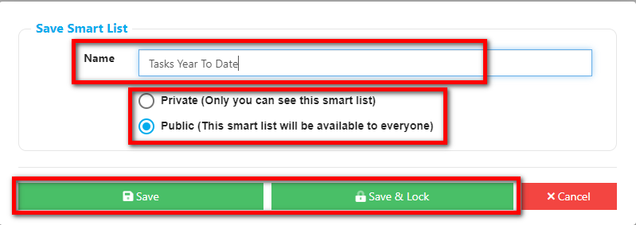

## Creating a Tasks Smart List

You can also create a Smart List to help Manage Tasks.  

?> For more information on Smart Lists, click [here](smartlists/CreatingaSmartListNEW.md)

From the Home Page, go to *Smart Lists & Tagging*.

From the drop down menu, select *Smart List Manager*.

To create a new Tasks Smart List, you can either click on the next to Tasks, or you can click on *+ Create New Smart List* and choose the option from the drop down list.

Now you can add the criteria for your Smart List in the Query Builder, click on *+ Add Criteria*.

From the options list, select the type of information you need from the Smart List, for example, I am looking for Tasks assigned to a Team.

Now I want to select a Team using *Any of*.

From the List of Teams, I would like to see Tasks associated with Administration & Finance Team, and those associated with Asset Maintenance & Faults Team. 

At this stage you have the option to confirm your selection by clicking *+ Add New Criteria* or alternatively if this isn't what you were looking for you can click *<Back* and try a different criteria, or *Cancel* to return to the Query Builder.

If you are happy with your selection, click *+ Add New Criteria* and you will return to the Query Builder.

You can see from the screen below, my selection appears across the middle, and now I have the option to add more criteria, or if I am satisfied with my selection, I can run the report.

You can add as many selections as you like, I am going to add when the Task is due by.

From the options I want to include Tasks due year to date.

Now the Smart List will search for all Tasks assigned to the Teams I selected, and of those Tasks, any that are due this year to date.

To run the Smart List, click on 

The Dashboard gives an overview of the results split into categories. You can drill down by clicking on the link within those categories.

The *Results* Tab will show a List of all the Tasks that meet the criteria you set, you can click on the links within Account ID or Task ID for specific details.

You can also select any of the options at the top, such as saving your Smart List, adding more columns to your list, or downloading your Smart List Report to Excel.

It would be worth saving your Smart List if you are likely to need to run a report on a regular basis. Smart Lists run with live information, so you know when you run a new report, the results are always current.

Click *Save*, give the Smart List a Name so you find it easily in the future. 

Select if you want it to be *Private* (only you can view it) or *Public* (anyone can run the report).

Click *Save* (anyone with edit permission can change the criteria) or *Save & Lock* (only Smart List Administrators can change the criteria).

Return to your Smart Lists and you will see your new Smart List has appeared, and you can re-run the report without the need to re-enter the criteria.

