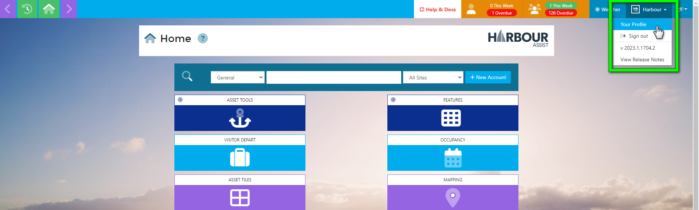

# Monitoring All Tasks

You can monitor all Users and Teams Tasks within the system by updating your User Profile.  This is particularly useful for those who have responsibility for other users or teams.

To do this, from the Home Screen, go to Your Profile.

In your User Profile, under Default Task Notifications, select a Site.

This will display a table with the following information.

1. Task Type - this lists all the Task Types,
2. Task Modification Events - this displays any changes that can be made to Tasks, and your notification options.

To change your Default Notifications, choose the Task Type you would like to be kept updated of any changes to, then tick the box of how you would like to be informed.

You can be notified by Email, SMS or by a Desktop notification.

Work your way through any Tasks Type, updating as you go.

Once finished, click *Save*.

?> NB: Any changes made will only take effect for any new Tasks created.

If you have responsibility for more than one site you can repeat the process above by selecting a different Site.

## Example Notifications

#### SMS Notification

#### Email Notification

#### Desktop Notification

