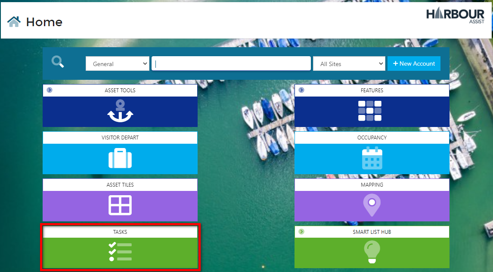
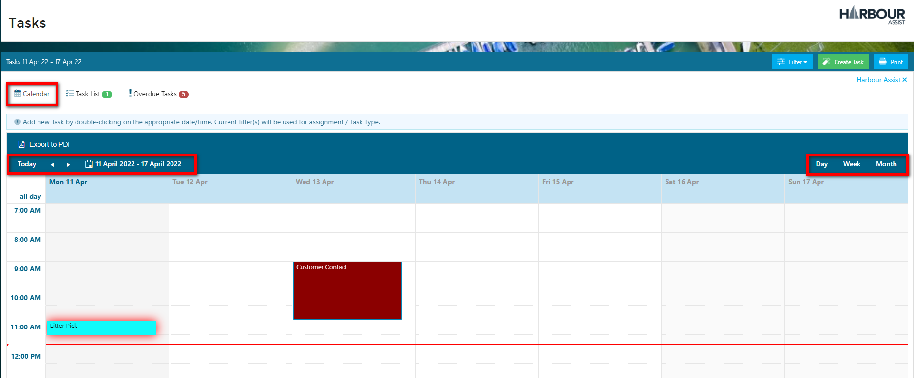
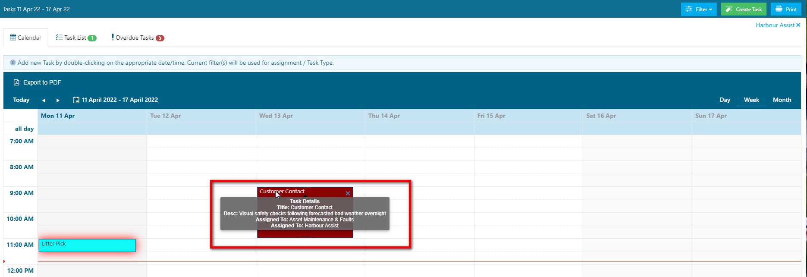
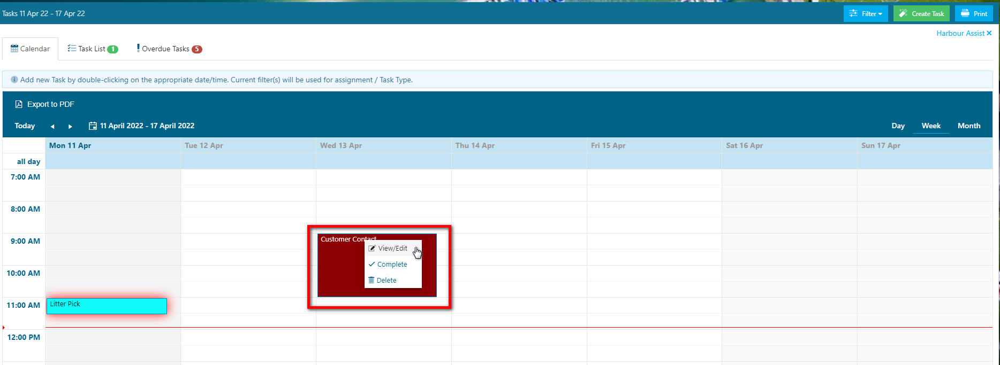
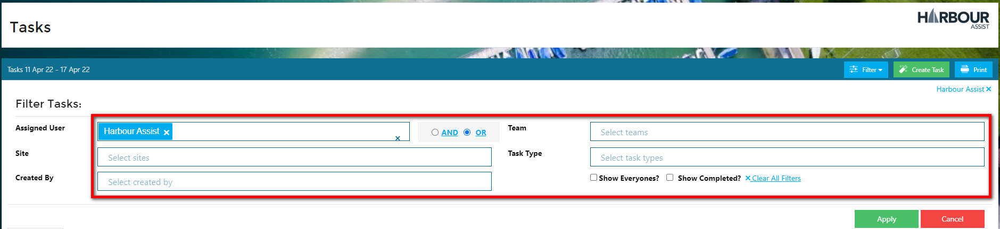
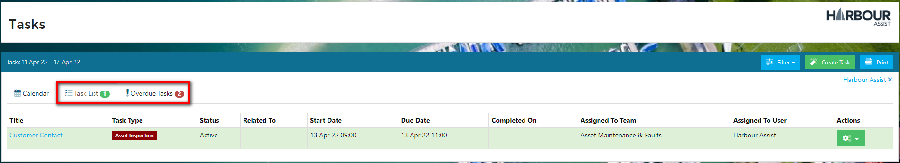
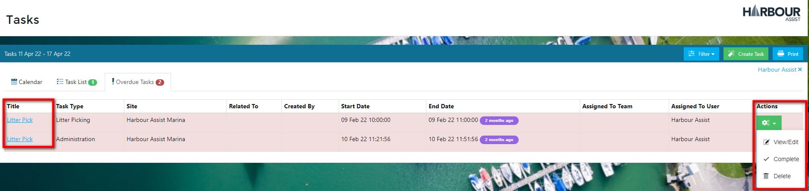

# Viewing Tasks

There may be times when you need to view the Tasks of a colleague or a Team that you are not part of.  Using the Tasks tile on the Home Page you will be able to see your Tasks and, using the filters, Tasks that are assigned to others.

From the Home Screen, go to *Tasks*.

## Calendar View

The Calendar view defaults to your Tasks and the current week, you can adjust the dates and view the Calendar in Day, Week or Monthly format.

By hovering your mouse over a Task in the calendar it will reveal more information about the Task.

Clicking on the Task will give you a drop down menu to *View/Edit, Complete or Delete the Task*.

?> NB: The ability to Edit or Delete Tasks are permission based.

**Add a bit about dragging to move date/time**

In the Calendar view, you can also print an overview of the Tasks or create a new task. 

?> For more information on Creating A Task click [here](Tasks/CreatingATask.md)

## Viewing other Users Tasks and Filtering

To view the Tasks of colleagues or Teams that you are not part of, or to search for Tasks of a certain type etc. you can use the *Filter*.

Click on *Filter*, populate the criteria accordingly and click *Apply*.

?> NB: Some of the criteria, such as *Show Everyone's* are permission based.

To see Tasks in a list view and to see Overdue Tasks, use the tabs to change your display.  Clicking on  *Task List* and *Overdue Tasks* will show you any incomplete Tasks, due and overdue, along with some additional details.

Clicking on the Title will take you to the Task, or you can use the Action button and select from the options menu.