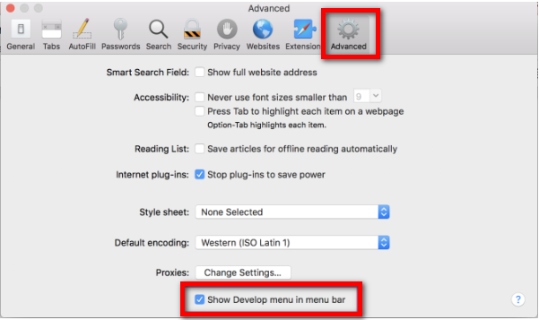
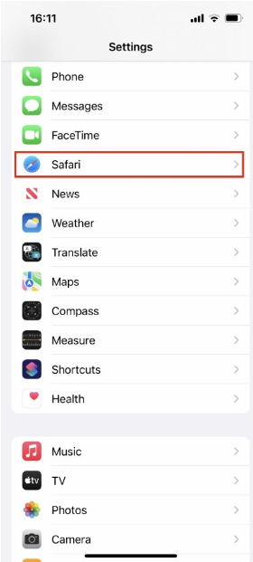
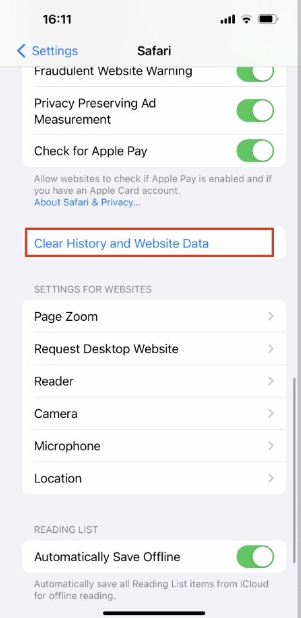
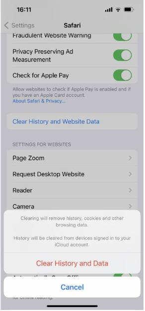

# How to clear the cache in Safari on Mac

?> NB: The following should be enough to guide you, however, some devices may differ, a simple web search will return instructions for your specific device.

## Clear Safari cache with a keyboard shortcut

The first, and quickest way to clear your cache is by using a keyboard shortcut: simply press **[OPTION] + [COMMAND] + [E]**.

## Clear Safari cache manually

While Safari is running, select the first option, Safari, from the top left of your menu bar.

Select Preferences… *or* use the keyboard shortcut [CMD] + [,].

A pop-up window will open. Select the **Advanced** tab.

Click the checkbox at the bottom of this tab that reads **Show Develop menu in menu bar**. 

A new item will now appear in the menu bar called **Develop**.

Whenever you want to clear your cache, click on **Develop** and then select **Empty Caches**.
Reload the page you’re on, and you’ll be good to go.

?> NB: There is no OK button, and then no visible confirmation that the caches have been cleared. But they have been.

# How to clear the cache in Safari on iPhone and iPad

Open **Settings**.
Scroll down to **Safari** and tap.

Choose **Clear History and Website Data**.
Confirm by tapping the new Clear History and Data button that pops up.

Unlike with the Mac, there is a visible indication that the cache has been cleared. The option for Clear History and Website Data is greyed out and unavailable.

