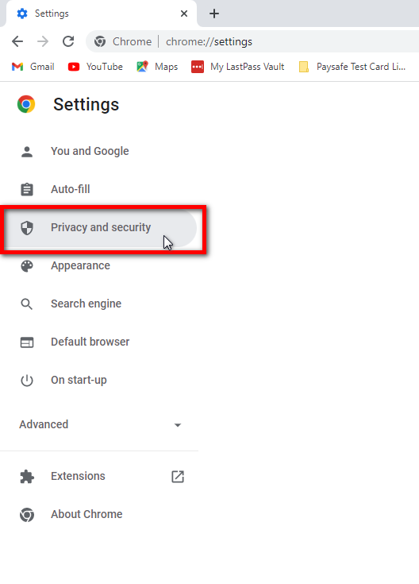

# How to clear your Cache - Google Chrome

?> NB: The following information should cover the majority of Chrome users, however, some devices may vary. A simple Google search for your specific device will guide you.

Click on the **3 vertical dots** in the top-right menu bar.

Click on **Settings**. This will open a new tab showing Chrome's settings.

Click on **Privacy and Security**.

Click **Clear browsing data**.

1. Ensure that **All time** is selected at the top of the popup.

2. Ensure that only **Cached images and files** is ticked.

3. Click on **Clear Data.**

Then go back to Harbour Assist and hit **Ctrl+F5** to refresh the page.
