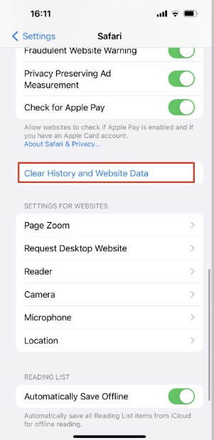

# Portal Troubleshooter

If a customer reports issues with logging into their portal please check the following:-

- Does the email address the customer is using to try to log in match the email address on their Harbour Assist account? If it doesn’t ask the customer whether they want to update their account email address.

- Type the email address into the Search on the Home page – does it bring back more than 1 account? If so, this could be the problem. The Portal Login uses the customer email address as a unique identifier – if there is more than 1 account with this email address the system will not know which accounts portal to open.

- If the email address is correct and there is only 1 account, on the Account tab have a look at the Account Portal details. Here you can see whether the customer is registered or not and if they are registered you have to option to view their Portal Login Attempts.

  

- View the customers Login Attempts – this will give you information about when they have tried to login and whether their attempt was successful or not – Green tick for Successful, Red cross for Unsuccessful.

  

  ?> NB: If the Browser column is showing the customer is using Safari, they may need to clear their Cache - please see below for instructions on how the customer can do this.

- If the customer has had 6 or more consecutive Unsuccessful login attempts, they will have been locked out. Advise the customer to use the Forgot your Password? Link on the Login Screen.

  
  
  

# Clearing the Cache 

Where customers are having issues signing in to their Customer Portal we commonly advise they clear their device cache.

## How to clear the cache in Safari on Mac

?> NB: The following should be enough to guide your customers, however, some devices may differ, a simple web search will return instructions for their specific device.

### Clear Safari cache with a keyboard shortcut

The first, and quickest way to clear the cache is by using a keyboard shortcut: simply press **[OPTION] + [COMMAND] + [E]**.

### Clear Safari cache manually

While Safari is running, select the first option, Safari, from the top left of the menu bar.

Select Preferences… *or* use the keyboard shortcut [CMD] + [,].

A pop-up window will open. Select the **Advanced** tab.

Click the checkbox at the bottom of this tab that reads **Show Develop menu in menu bar**. 

A new item will now appear in the menu bar called **Develop**.

Whenever you want to clear the cache, click on **Develop** and then select **Empty Caches**.
Reload the page you’re on, and you’ll be good to go.

?> NB: There is no OK button, and then no visible confirmation that the caches have been cleared. But they have been.

## How to clear the cache in Safari on iPhone and iPad

Open **Settings**.
Scroll down to **Safari** and tap.

Choose **Clear History and Website Data**.
Confirm by tapping the new Clear History and Data button that pops up.

Unlike with the Mac, there is a visible indication that the cache has been cleared. The option for Clear History and Website Data is greyed out and unavailable.

