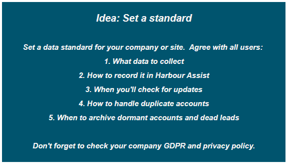
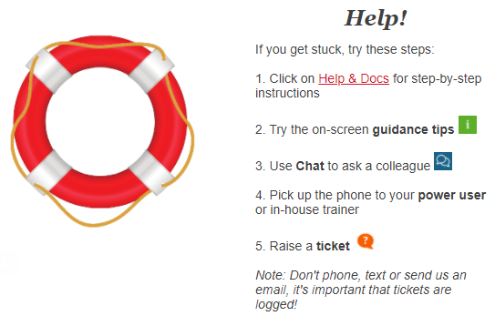

Issue 1: September 2020

# Topic: Data Quality

Welcome to the first quarterly email for Harbour Assist users. We know that every marina and harbour has different processes, but we'd like to share good ideas, best practice and system hints to help you make the most of Harbour Assist.

These emails are for all Harbour Assist users, whatever your role or seniority. Each edition will focus on a topic that is relevant to the marina year or is a regular support request. Use these emails as a resource alongside [Help & Docs](http://docs.harbourassist.com/#/), Guidance Tips and Help Tickets.

### Rubbish in, rubbish out

This quarter’s topic is data quality. Boring!

Well, yes, the basics aren't very thrilling. But getting these things right makes everything else work smoothly.

Think of it like building a house. Without strong foundations, the house will crack and fall.

If the data in a database is an inconsistent muddle, it makes using the database harder and reporting impossible. In the world of computing, this is known as rubbish in, rubbish out, (or garbage in, garbage out if you prefer).

Rubbish data is:

·     Multiple accounts for the same person or boat

·     Missing information (such as no phone number for a customer)

·     Inaccurate information (like the wrong boat length)

·     Bad spelling (of boat or customer details)

·     Incorrect capitalisation (joHn sMITH)

·     Incomplete address details or address entered into the wrong fields (for example all on one line)

·     Out-of-date information - deceased customers, sold boats and accounts that should be archived

### So what?

Does it matter if some dockmasters aren't great at spelling, especially when customers have silly boat names?

Yes, it does matter. Because the rubbish out means:

·     Longer time to [search for the right account](http://docs.harbourassist.com/#/GeneralNavigation/HomepageLayout)

·     Inability to contact a customer in an emergency

·     Boats allocated to unsuitable berths

·     Time wasted editing mail merge emails or letters

·     [Virtual terminal payments ](http://docs.harbourassist.com/#/AccountsOrdersPayments/Payments?id=using-the-virtual-terminal-phone-payments)failing address verification check

·     Grumpy customers being asked repeatedly for the same information

·     Dispute resolution takes longer when the history is incomplete

·     Inaccurate reporting makes it difficult to plan and budget

### Icing the data cake

Once you’ve got the basics like name, address, phone, email and boat data on the customer account, you can start to look at the extras that add value for you and your colleagues.

**Capturing incoming emails**
If you send all emails to customers using Harbour Assist, there is a permanent record for everyone to see. But emails that come in from customers sit in external email accounts and are only visible to the recipient. 

You can forward emails from your Outlook (or other) inbox to the customer’s account using [Track Mailbox](http://docs.harbourassist.com/#/communications/CreatingIndividualEmails?id=track-mailbox). It takes seconds and means that all colleagues can access the complete customer history.

**Adding documents**
[Upload documents ](http://docs.harbourassist.com/#/Documents/Docs?id=overview)like insurance certificates, boat safety forms, incident reports and others to the customer’s account.

These can be in DOC, PDF, JPG and other file formats. Assign an expiry date to time-critical documents to [run a report ](http://docs.harbourassist.com/#/Documents/Docs?id=document-expiry-reporting)on expired and due documents to ensure you have the latest version.

**Adding photos**
It can be handy to add photos of the boat to the record. It helps staff on dock walks to check that the right boat is in the berth when the name isn’t visible and it’s a useful record of the vessel.

Simply click on the Boat Details Info tab and select a file to upload by clicking the ‘Choose Files’ button on the right. JPG and PNG file formats are accepted. If you’re using an iPad, just point and shoot!

