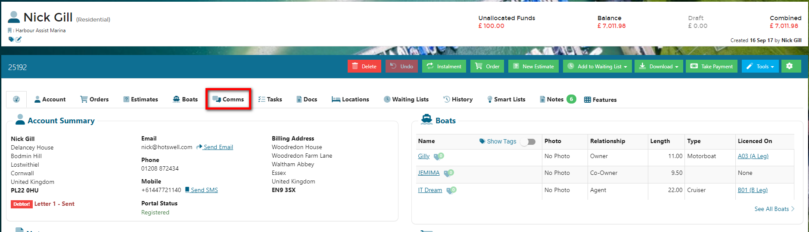
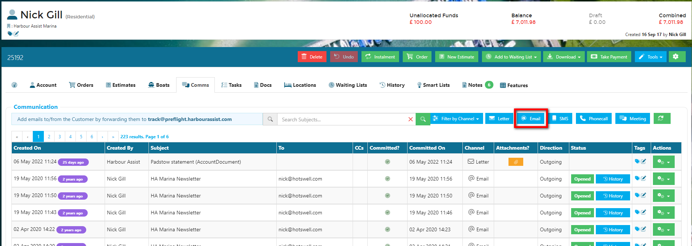
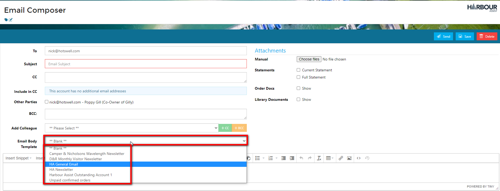
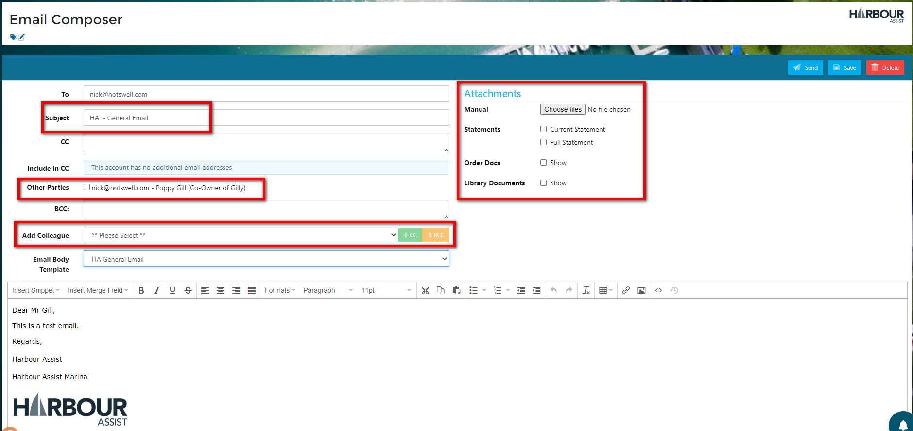
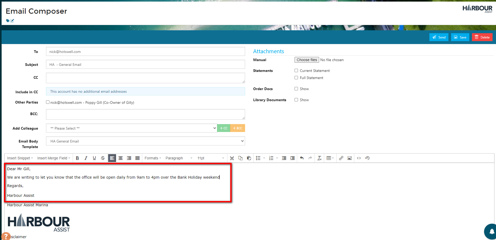
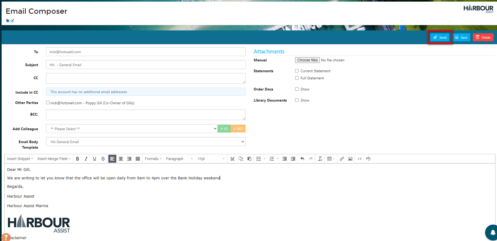
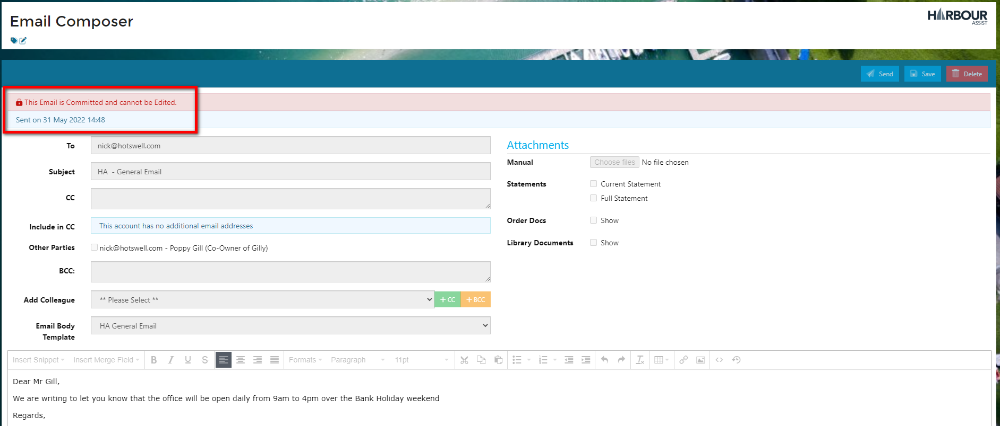
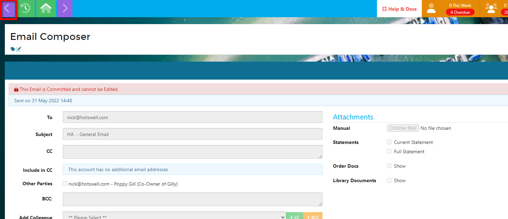
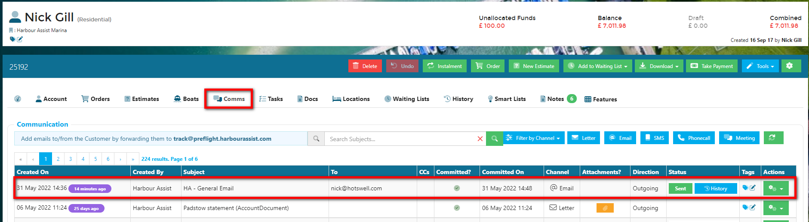

Email Communications
===

Individual email communications with customers can be done either directly through Harbour Assist or via your normal email system such as Outlook or Gmail and *'Tracked'* to Harbour Assist.

## Sending an Email from Harbour Assist ##

From the customer Account select the *Comms* tab.

Select Email.

You can now select the template that you wish to use from the drop down list of templates.

?> More documentation [here](communications/EmailTemplates.md).

Give your email a *subject* - this will default to the template name, so be sure to change this so that it makes sense to the recipient.  This subject also appears in the *Communications* summary so be as clear as possible so that other colleagues looking at the communications have a good idea what the email was about without having to view it.

You will see that the email has been automatically populated with the account holders email address.

Now you can add any other recipients - 

- You can manually enter email addresses to receive a CC or BCC
- Add a Colleague ie. another user of Harbour Assist - choose their name from the drop down list and then click on CC or BCC (the green and yellow buttons) to add them.
- Other parties - if the account has a boat that has a relationship with another account ie. there is a co-owner, these will show as Other Parties - just check any that require a CC of the email.

You can also add any attachment to the email -

- Manual - to upload a saved files
- Statements - check the box if you want to send the customer a statement of their account
- Order Docs - send the customer a copy of an order(s) by selecting from the list
- Library Documents - add any files that have been uploaded to Harbour Assist - your Terms & Conditions for example.

?> For more information about Library Documents click [here](communications/StaticFiles.md).

You now need to add your text to the email. 

At any point during the email writing process you can save your email - this will save it as a draft which is still fully editable.

Once you are happy with your email, its appearance and content, select *Send*.  

This will send the email to the recipient(s) and it can no longer be edited.

To exit this screen, click on the *back* arrow.

Going back to the *Comms* tab, you will see the email is now shown in the list of communications for that account.  

