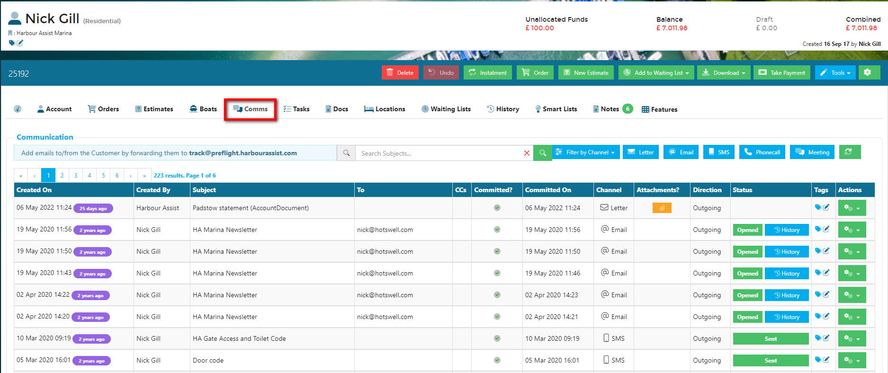
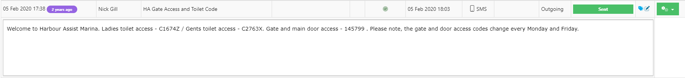
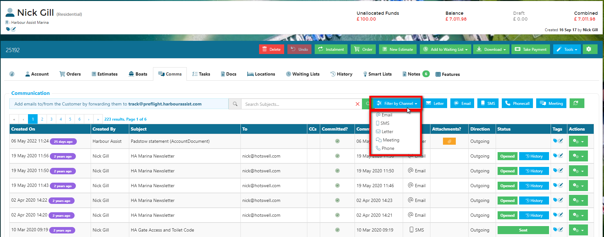
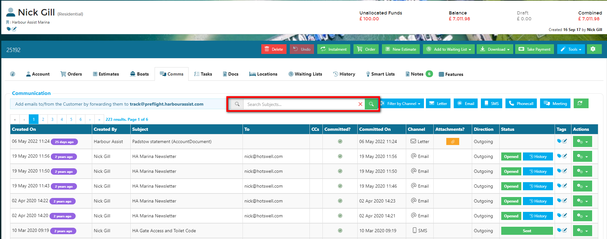
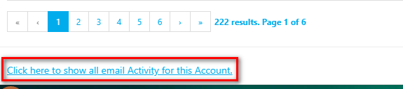

# Overview

The Comms tab on an account is where you can create new communications for individual accounts and where all the communications are logged (both ad hoc and bulk communications).  The Communications show in date order with the most recent at the top.

By clicking anywhere on the line of a communication you can quickly view the body text.  Just click on the line again to close this down.

You can filter the view to show communications by channel by using the drop down options.

You can also search by the communication subject by entering a key word; therefore giving the communication a sensible subject when creating it is important.

?> NB. So that the Comms log doesn't get cluttered up with records of Orders, Receipt, Credit Notes etc that have been emailed, these do not show in the log of communications that you see by default.  To view these go to the very bottom of the Comms log and use the *Click here to show all email activity for this account* feature.

