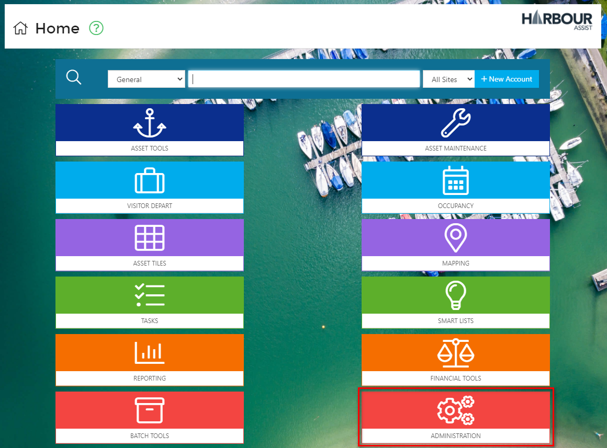
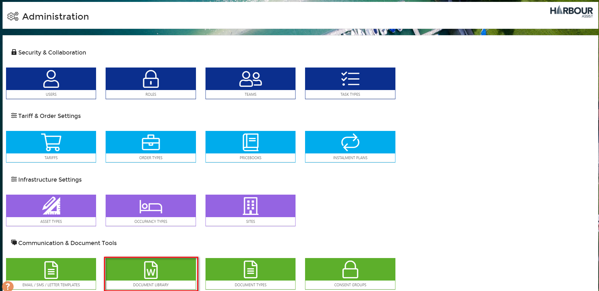
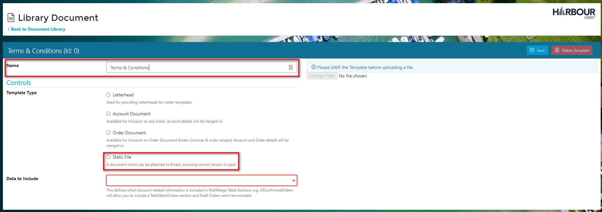
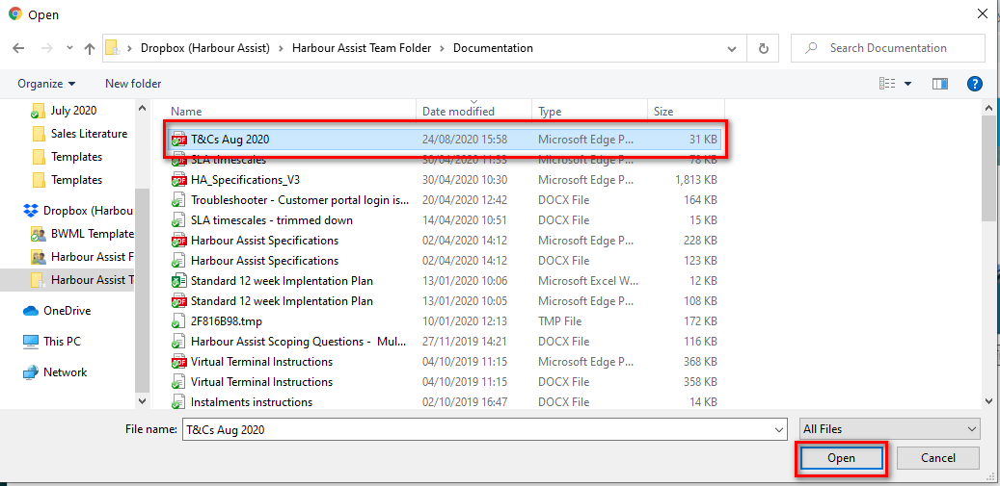
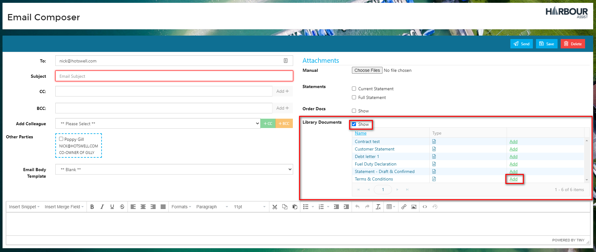

# Adding a Static File

Sometimes it's useful to attach a document like a marina/harbour map, blank form, your Terms & Conditions to an email - these are known as static files.

A static file is a document that doesn't change, so has no customer or boat information merged into it ie. the content is Static rather than Dynamic.  

Static files can be uploaded into Harbour Assist so that they can easily be attached to an email to a customer.  The benefit of uploading static files into Harbour Assist is that they can be easily maintained and updated in one place, rather than multiple users having the same document saved on their desktop or in files etc where there is a risk that old versions may be attached to emails.

?> NB: The uploading of Static Files is permission based; the Permission required is **AdministrationTemplates**.

To upload a Static File; from the *Home* page select *Administration*.

Then select *Document Library*.

Click on *New Word Template*.

Give the Template a name and then click on the Template Type of *Static File*.

?> NB: As this is a *Static File* no data will be merged into it, so you will note once you select *Static File* the *Data to Include* cell disappears.

Click on *Save*.

Now you can upload the file - click on *Choose File*.

Select your file and then click on *Open* to upload it.

You will see the file uploaded against the Template.

The Template will appear for selection when creating an ad hoc or bulk email under *Library Documents*.

