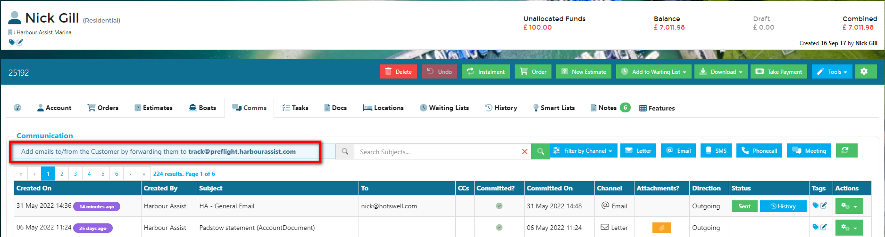

# Track Mailbox #

To help you include important emails in an Account's Communication history, Harbour Assist provides a *Track* mailbox that allows you to forward emails from anywhere.  

This *Track* address will show at the top of any Comms page.

**As long as the email address stored in Harbour Assist is somewhere in the message, the email will be picked up and attached as a Communication against the Account.**

This can be used when:

- You have received an email from a Customer directly into your inbox and you think it's worthwhile appearing Account's Communication history, for example if they have made a complaint.
- Emails you send from Outlook that you want to appear in Harbour Assist.

### Sending from your Email Account ###

If sending the email from your company email system (e.g. Outlook), the *Track* address should be entered in the Bcc address field of the email.

By doing this, the email will automatically be attached to the account as long as the email address on the account matches the email address you are using to send the email.

As described above, replies received from account holders can be logged on their Harbour Assist account by **forwarding** the response to the *Track* email address.  Again the email address in the Account needs to match the one contained in the email.