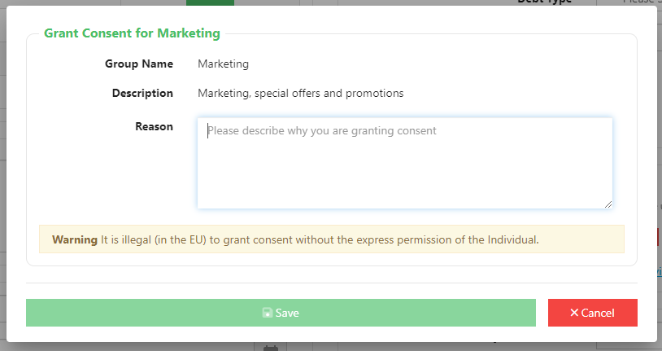

# Consent Groups

Under GDPR (General Data Protection Regulation) customers have the right to opt in or out of non-operational communications, such as Newsletters and 3rd Party Marketing.

Consent Groups enable you to define the type of communication you are sending and who you are able to send it to.

## Viewing Consent Group Details

From the **Home Page**, go to *Administration*.

Next, go into *Consent Groups*.

This page provides a summary of your current Consent Groups, including the Name, Internal & External Descriptions and how many Members each group has.

Using the *Actions* button, you can Edit the Consent Group and View Members.

Selecting *View Members* displays details of the members within the group. You can use the links to review the individual accounts and history and download the list to excel.

Clicking on the *History* button provides a timeline of what actions were taken, when they were take, any reasons given and the source of the action.

You can download this information to PDF or to Excel.

## Creating a New Consent Group

To create a new Consent Group, click the *+New Consent Group* button.

Give your Consent Group a **Name**. 

Add an **Internal Description** - this will be what other Users of Harbour Assist will see.

Add an **External Description** - this will what your customers will see. 

When finished, click *Save*. Your new Consent Group will now appear in the list and will be visible to both Users and Customers.

# Using Consent Groups

Customers must opt in to receive non-operational communications, and have the right to opt out at any time. 

This can be done in two ways.

### Customer Portal

Customers can opt in and out by toggling the consent button within the Notification Preferences section in their Customer Portal or within the Account Details section if they click on Edit Details.

### Customer Account

A Harbour Assist User can edit the preferences on request of the customer from within the **Account Tab**.

Find the relevant account, scroll down to *Consent Groups*, and use the *Actions* button to either Grant or Revoke Consent.

Remember, GDPR is a legal requirement and Granting Consent must be at the **express permission of the customer**.

You will be required to include a reason for both granting and revoking consent, and *these actions are recorded in the Consent History*.

### Sending non-operational communications

When sending non-operational communications, such as bulk emails from Smart Lists, you have to choose one or more specific Consent Groups to send the communication to, thus ensuring only those receiving the information are those who have consented.

?> More information on Sending Bulk Email Communications can be found [here](smartlists/BulkEmailingNEW.md)

?> More information on Sending Bulk SMS Communications can be found [here](smartlists/smsNEW.md)

