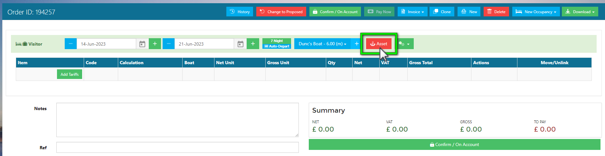

# Creating a Visitor Order

You can create a visitor order from a number of areas within Harbour Assist, such as the Occupancy Calendar, Mapping or from a Customer Account.

Wherever you choose to create a Visitor Order in the system, you can create advance bookings, or raise on Order on the day of arrival.

There isn't a right or wrong option, they all create an Order and only the sequence of information differs.

For example:

##### Creating a Visitor Order from the Occupancy Calendar.

- Select the Asset/Berth the Visitor will be occupying during their stay.
- Select a Start and Departure date from the Asset line.
- Confirm the Occupancy Type.
- Search for an existing Account/Boat, or create a new account in the same way as you would from the Home Page.
- Raise a Visitor Order.

##### Creating a Visitor Order from an Account.

- Use the Search Tool to find an existing Account, or create a new Account.
- Raise a Visitor Order in the Customer Account.
- Select the Start and Departure dates.
- Select the Asset.
- Complete the Order as normal, adding any relevant Tariffs.

##### Creating a Visitor Order from a Map.

- Select the Asset/Berth by clicking on the Marker.
- Add an Occupancy and select the Occupancy Type.
- Search for an existing Account/Boat, or create a new account in the same way as you would from the Home Page.
- Select a Start and Departure date.
- Raise a Visitor Order.

### Creating a Visitor Order from the Occupancy Calendar

From the Home Page, go to *Occupancy*

In the Occupancy Calendar, you can use the filters as required to find the right Berth, and select the required dates from the Calendar Picker.

In the Calendar, select the date the Visitor's arrival date by clicking on the cells in the Asset line. The cell will turn green.

Next, select the date the Visitor is expected to Depart. This cell will also turn green briefly before opening a new window.

From your selections in the Calendar, the system already knows which Asset they will be on, and how long they are going to be there.

Now you need to tell the system what type of Occupancy you want to create, click on the Type and select *Visitor*.

Next, you need to confirm which Account. 

Using the search tool, enter the name or account number. The search tool works in the same way as the search tool in the Home Page.

From the list of Accounts, select the account or if the customer account doesn't appear, create a new account by pressing the 

You can add any notes as required, other Users can see these notes by hovering over the Occupancy in the Calendar.

Once all the relevant information is complete, check the details and when happy, click *New Order*.

If you would like to create an Occupancy without an Order, you can just click *Save* .

Select the *Order Type*.

An Order will now be generated. The Occupancy details have been populated from the information given, check these are correct.

You can still make adjustments as required, such as extending the dates or changing the Asset.

Complete the Order as normal, adding any relevant Tariffs.

You can view your Visitor Occupancy in the Calendar.

### Creating a Visitor Order from an Account

Using the Search Tool, find an existing Customer, or create a new Account.

From the Customer Account, click on *Order*.

Select the Order Type.

Creating the Order through the Account, the system already knows who the Customer is, now you need to confirm the rest of the details.

Select an Arrival and Departure date.

Select the Asset the Visitor will be staying on.

Finally, complete the Order as normal, adding any relevant Tariffs.

Your new Occupancy can be viewed in the Occupancy Calendar and Mapping screens.

### Creating a Visitor Order in Mapping

From the Home Page, click on *Mapping*.

In the Map page, apply the relevant filters and date range to check for availability. 

Select suitable Asset/Berth by clicking on the Marker.

A window will pop up containing the Asset details to review, if the Asset/Berth isn't suitable, click *Close* and select another Marker.

Next, click on *Add Occupancy*

Select the Occupancy Type.

The system knows which Berth you are creating an Occupancy on and the Occupancy Type. 

Next, you need to confirm which Account. 

Using the search tool, enter the name or account number. The search tool work in the same way as the search tool in the Home Page.

From the list of Accounts, select the account or if the customer account doesn't appear, create a new account by pressing the 

Now you need to confirm the Arrival and Departure dates, and add any notes if required.

When all the details have been entered, click on *New Order* and complete the Order as normal.

If you would like to create an Occupancy without an order, click on *Save*.

Your Occupancy will now show on the Map and you can click on the Marker to view the details.

