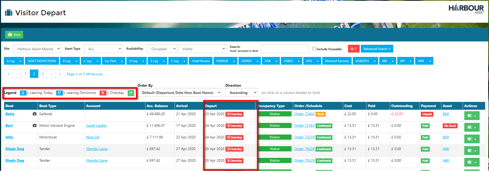
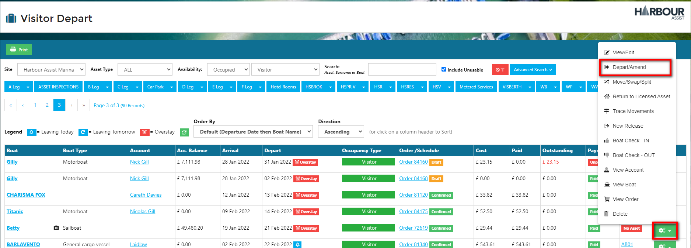
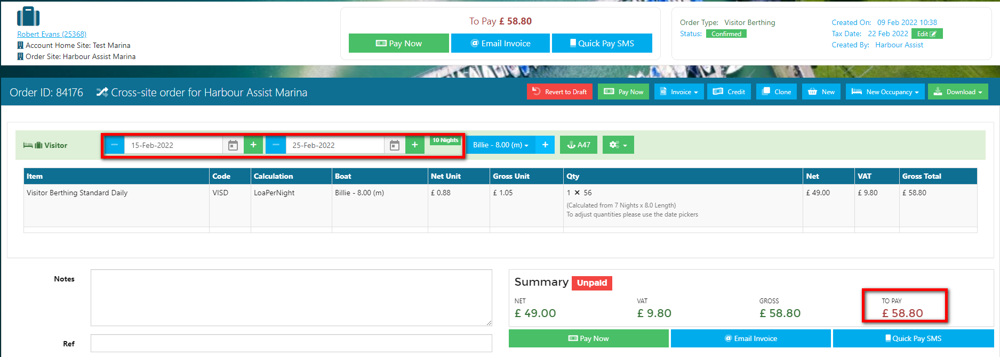
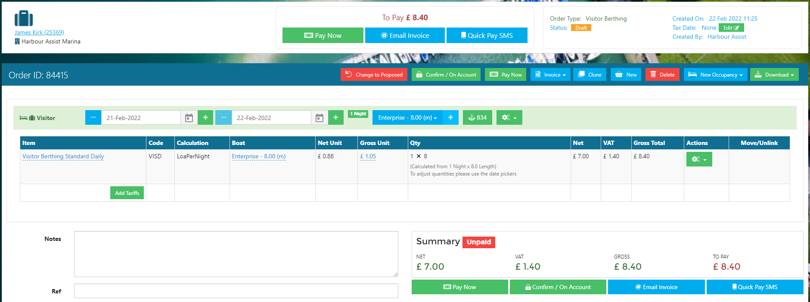

# Managing Visitors #

## Overview ##

When dealing with Visiting craft, customers will inevitably change their minds, therefore the *Visitor Depart* function has been developed to:-

- Allow customers to change their mind and the system re-calculate what they owe,
- ensure that all visitor revenue is captured. 

For this function to work correctly, all Visitor Occupancies must now be *Departed*.

To manage your Visitors, from the *Home* page, select *Visitor Depart*. 

In the *Visitor Depart* screen, ensure the correct site is selected (for multi-site operators).  The screen will automatically populate to show all **Asset Types** that are currently **Occupied** with a **Visitor** occupancy and historic Visitor Occupancies who have not yet been marked as Departed.

?> NB. To view Visitors who may be on Unusable Assets, please ensure you check the *Include Unusable* box.

The symbols in the *Depart* column mean you can easily see craft who are due to leave that day, the next day or who have *overstayed* their original intended occupancy.

The Order details are shown - **Order** Number and Status (Confirmed or Draft), **Cost**, how much has been **Paid**, **Outstanding** amount and **Payment** status.

If a Visitor Occupancy has been created and no order raised, the Visitor will show and there will be a *New Visitor Order* button showing in the Order/Schedule column. Use this to raise a Visitor Order for the Occupancy.

## Departing and Amending Visitor Occupancies ##

Using the *Actions* button and *Depart/Amend* for each Visitor you can Depart, Amend and update their Occupancy and Order. 

What happens when you click on the Depart/Amend button depends on the current state of the Visitor Occupancy - the system will guide you through your options, but below are some of the scenarios.

### **If the Order is a Draft, Unpaid and they are leaving today as expected.**

Click on the *Depart/Amend* icon.

If the customer is about to leave, select *Take Payment (Departing Now).*

Take the payment in the usual way.

Going back into *Visitor Depart* the order is now showing as Paid, so using the Actions button and Depart/Amend you can Depart the boat.

### **If the Order is in Draft, Unpaid and they should have left previously (i.e. they are an Overstay) but are now leaving today.**

Using the Actions button, click on the *Depart/Amend* icon.

The system will recognise that the customer is an 'Overstay' and will prompt you to update their draft order.

To do this select *Yes (Departing Now)*.

Select *Yes* to adjust the Order.  

Orders with duration-based Tariffs will automatically be adjusted to todays' date.  You will note the departure date and order amount will change to reflect this.

You can now take the payment in the usual way.

Going back into *Visitor Depart* the order is now showing as Paid, so using the Actions button and Depart/Amend you can Depart the boat.

### **If the Order is unpaid, in Draft and the customer wishes to extend their stay prior to their original departure date (i.e. the system does not yet show them as an Overstay).**

From the *Visitor Depart* screen, click on the Order ID.

Amend the departure date by either using the + button or the calendar selector.

Orders with duration-based Tariffs will automatically be adjusted to reflect the new departure date.

In the *Visitor Depart* screen, the new departure date and amended amount of the order will show.

### **If the Order is Confirmed (paid or unpaid) and they are an Overstay.**

Using the Actions button, click on *Depart/Amend*.

You will be prompted whether you wish to create a new Order.  The new Order will clone the previous Order - apply the same tariffs and set the Occupancy dates to start from when they were supposed to Depart to todays' date. 

To do this select *Yes (Departing Now).*

A new Order has been created to cover the period between their original departure date to todays' date.

Payment for all outstanding orders can be taken at the same time in the usual way.

Going back into *Visitor Depart* the order is now showing as Paid, so using the Actions button and Depart/Amend you can Depart the boat.

### **If a Visitor Occupancy has been created, but no order has been raised.**

Use the *New Visitor Order* button to create an Order.

The Order will automatically by populated with the dates of the Occupancy and will alert you if it appears the boat has *Overstayed* their occupancy.  If you need to amend the dates you can do this be clicking on the **- and +** keys, or by using the date selector icon.  

Once your dates are correct, select the tariff to be charged by clicking *Select Tariff* in the usual way.

The Order details are now shown in the *Visitor Depart* screen.

